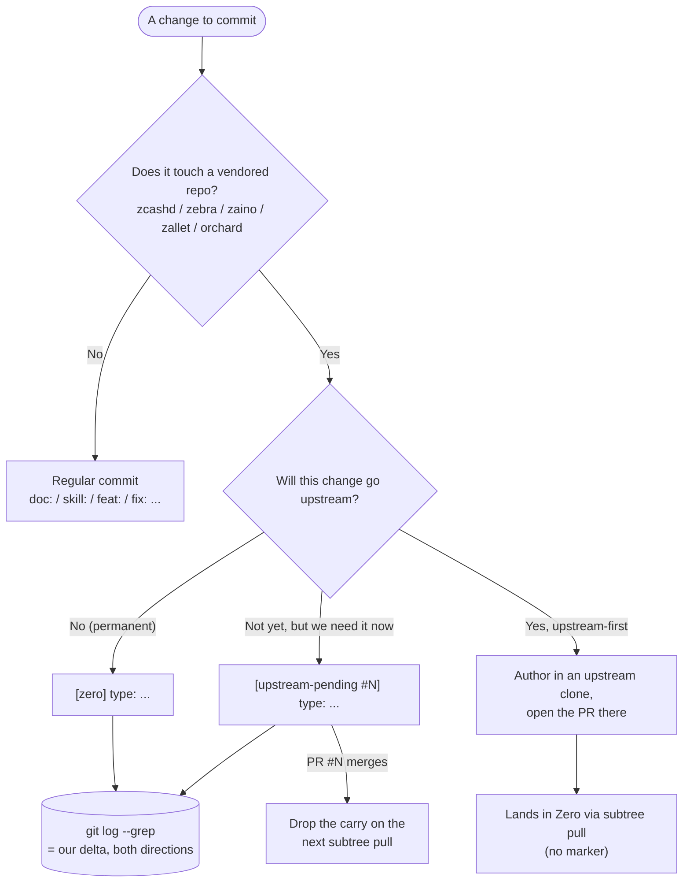

# Zero

[](https://github.com/RichardLitt/standard-readme)

> Enterprise Zcash infrastructure, supported by Shielded Labs.

Zero is a supported suite of open-source Zcash infrastructure software maintained
by Shielded Labs for enterprise use. It helps exchanges, mining pools, wallet
providers, and other ecosystem partners deploy and operate Zcash infrastructure
successfully as the network prepares for Ironwood and future upgrades.

## Table of Contents

- [Background](#background)
- [Install](#install)
- [Usage](#usage)
- [Security](#security)
- [Maintainers](#maintainers)
- [Contributing](#contributing)
- [License](#license)

## Background

Operators preparing for Ironwood, and for support beyond it, need practical
options: documentation, migration assistance, and reliable software. Zero
provides that support across five vendored components, each a git subtree from
its canonical upstream:

| Component | Directory | Upstream                     | Role |
|-----------|-----------|------------------------------|------|
| zcashd    | `zcashd/` | zcash/zcash                  | Supported fork with a hardcoded end-of-life, as a transition path only |
| Zebra     | `zebra/`  | ZcashFoundation/zebra        | Validator node |
| Zaino     | `zaino/`  | zingolabs/zaino              | Indexer |
| Zallet    | `zallet/` | zcash/wallet                 | Wallet |
| Orchard   | `orchard/`| zcash/orchard                | Shielded protocol crate (Ironwood) |

Many exchanges, mining pools, and wallet providers depend on `zcashd`-based
infrastructure today, and the Ironwood timeline is aggressive, so we provide a
supported `zcashd` fork as a practical transition path with a hardcoded
end-of-life date.

> [!NOTE]
> We are not advocating long-term reliance on `zcashd`. The long-term direction
> is the Zebra, Zaino, and Zallet (Z3) stack.

See [SUBTREES.md](SUBTREES.md) for the vendoring mechanics and
[MAINTENANCE.md](MAINTENANCE.md) for how we make and track changes.

## Install

The monorepo is self-contained; cloning it brings every component with it.

```sh
git clone https://github.com/ShieldedLabs/zero.git
cd zero
```

There is no top-level build yet. Build each component with its own toolchain,
following that component's own README:

```sh
cd zebra  && cargo build --release   # likewise zaino/, zallet/, orchard/
cd zcashd && ./zcutil/build.sh -j"$(nproc)"
```

## Usage

For most operators, we generally recommend:

- Zebra for `getblocktemplate`
- Zebra mining nodes
- Zebra in front of existing `zcashd` deployments where appropriate
- Migration toward the Zebra, Zaino, and Zallet (Z3) stack over time

Refer to each component directory for configuration and operational guidance.

### Deployments

- [Shield zcashd behind Zebra](deploy/zcashd-behind-zebra/) - put Zebra in front
  of zcashd to remove zcashd's network-facing attack surface. Docker Compose,
  config files, systemd units, and a verification cheat-sheet.

## Security

To report a security vulnerability in any Zero component, join the Shielded Labs
security disclosure group on Signal:

https://signal.group/#CjQKICZtmwnx-qJlNzqu9ACZno_s9hMZhELfjod-KBGXVXxUEhA-p8Ai5BgwAVVllZvDV6tb

This is a triage waiting room. Once admitted, say only that you have a report; the
team moves you into a private group with the relevant people to disclose the
details, then removes you from the waiting room. Each component repeats this
contact in its own `SECURITY.md` (zcashd, Zebra) or README (Zaino, Zallet, Orchard).

Please do not open public issues for security-sensitive reports.

## Maintainers

[Shielded Labs](https://shieldedlabs.net).

## Contributing

Zero vendors five upstreams, so the central discipline is keeping our divergence
small, explicit, and classified. Read [MAINTENANCE.md](MAINTENANCE.md) for the
full policy; the commit convention is the part you touch every day.

One question decides how to tag a commit: **does it touch a vendored repo?**



In short:

- **No**, it touches only our own files (README, docs, `.claude/`): a regular
  conventional-commit message, no marker.
- **Yes**, and the change is a permanent Zero-only divergence: `[zero] type: ...`.
- **Yes**, but it is a stopgap we need before an upstream PR merges:
  `[upstream-pending #N] type: ...`, dropped on the next subtree pull after #N
  lands.
- The cleanest upstream path produces no marker at all: author the change in an
  upstream clone, open the PR there, and let it arrive via `subtree pull`. The
  `upstream-change` skill helps prepare those PRs.

This makes our delta greppable in both directions, with no ledger to maintain.
Scope the query to the vendored dirs so it stays accurate even if a marker is
ever misapplied to a root-file commit:

- `git log --grep='^\[zero\]' -- zcashd zebra zaino zallet orchard` - permanent divergence
- `git log --grep='upstream-pending' -- zcashd zebra zaino zallet orchard` - outstanding carries

The commit body carries the rationale.

### AI assistance disclosure

The Zero monorepo scaffolding, maintenance tooling, and documentation were
developed with the assistance of Claude Code (Anthropic), under human review by
Shielded Labs. Changes vendored from upstream remain the work of their respective
projects.

## License

Each vendored component remains under its upstream license (Apache-2.0 and/or
MIT); see the `LICENSE*` files within `zcashd/`, `zebra/`, `zaino/`, `zallet/`,
and `orchard/`. Zero-specific files are © Shielded Labs.
