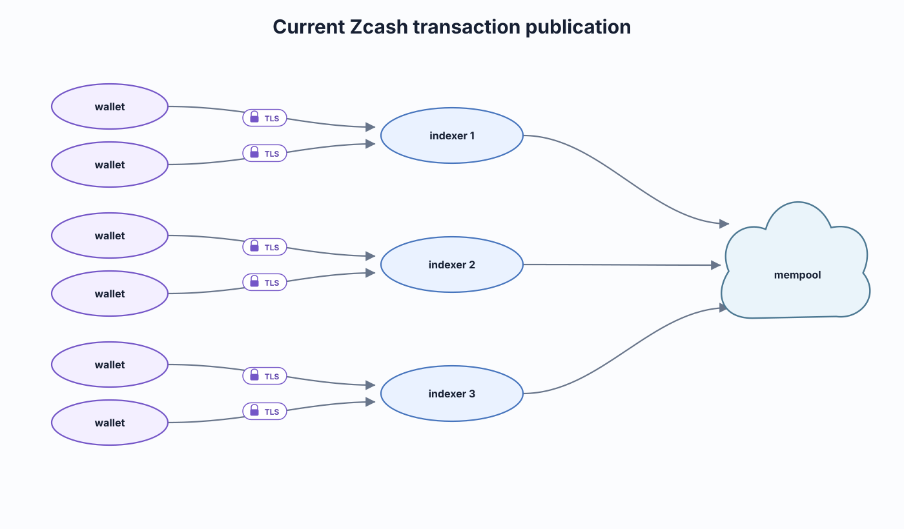
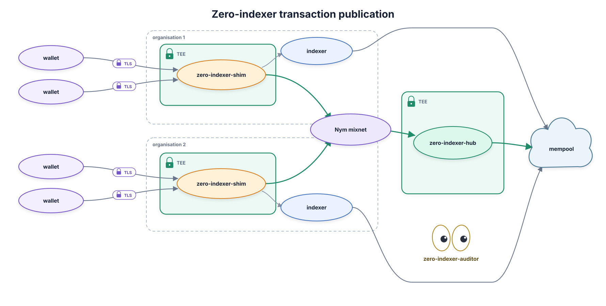

# zero-indexer

Privacy for Zcash light wallets: an attested front-end that stops pool-crossing transactions from leaking your IP.

Under the [ZIP 307](https://zips.z.cash/zip-0307) light-client protocol a wallet talks to an indexer over clearnet, so the operator sees its source IP and the timing of everything it does. `zero-indexer` is a Shielded Labs product that stops transactions that contain Orchard actions from leaking a user's IP.

**The long-term vision** is a wallet-facing private indexer serving queries, not just broadcasts, over Nym, terminated inside an attested enclave, with PIR added later as a hardware-independent layer.

## Table of Contents

- [Security](#security)
- [Background](#background)
- [Install](#install)
- [Usage](#usage)
- [How it works](#how-it-works)
- [Status](#status)
- [Maintainers](#maintainers)
- [Thanks](#thanks)
- [Contributing](#contributing)
- [License](#license)

## Security

`zero-indexer` targets the server-side and network-metadata adversaries in Taylor Hornby's [wallet app threat model](https://zcash.readthedocs.io/en/latest/rtd_pages/wallet_threat_model.html), not the wallet-local concerns that model assigns to the wallet.

**Protected**

- **Broadcast contents.** The operator no longer terminates the wallet's TLS. The key is born inside the enclave, so an Orchard-touching transaction reaches the operator's host as ciphertext it has no key for, rather than as plaintext at its indexer. The attestation is what makes this checkable: it proves the endpoint is the reviewed build and that the certificate's key was born inside it, so an operator cannot quietly substitute its own.
- **Source IP.** The on-chain transaction carries no link to the wallet's IP, because the hub publishes it rather than the wallet. Volume-independent: it holds however few others are migrating.
- **`GetTransaction`.** The shim routes every lookup to the hub, so the operator cannot watch a wallet fetch back the transaction it just diverted. This moves the lookup to the hub rather than making it private outright.

**Not protected**

- **Transparent-pool queries.** `GetTaddressTxids`, `GetTaddressBalance` and `GetAddressUtxos` are not intercepted and still reach the operator. Say the consequence plainly: the reference light-client SDK hands the operator's own indexer the wallet's whole transparent address set, and from those the operator can recover a diverted transaction's txid **and its value**. So "the operator does not learn the amount" is not a claim this design supports for a wallet that touches the transparent pool.
- **The size of a wallet's submission.** TLS terminates inside the enclave, so the operator never sees plaintext -- but TLS hides content, not length. The wallet-to-shim leg is unpadded, so the operator observes `|tx|` and the instant it arrived. Transaction sizes are public on-chain, so that pair can be matched against the published batch, and for an unusually sized transaction it identifies which member is which. The shim-to-hub leg was padded to a fixed frame in August 2026; this leg was not, and it cannot be fixed in the shim, because padding has to happen at the sender.
- **Physical security is delegated to AWS.** Nitro's memory isolation and hardware root of trust are what keep the operator out of the enclave, which means the guarantees above hold against everyone except AWS itself.

### Reporting

Report vulnerabilities through the Shielded Labs security disclosure group on Signal, the same channel as the rest of the Zero distribution:

<https://signal.group/#CjQKICZtmwnx-qJlNzqu9ACZno_s9hMZhELfjod-KBGXVXxUEhA-p8Ai5BgwAVVllZvDV6tb>

That group is a triage waiting room. Once admitted, say only that you have a report and do not post details there; you will be moved into a private group with the relevant people to disclose, then removed from the waiting room.

## Background

A light wallet delegates chain validation to an indexer over [ZIP 307](https://zips.z.cash/zip-0307). The protocol gets note privacy right and metadata privacy wrong: trial decryption is client-side, so the indexer never learns which notes are yours, but it terminates your connection, so it sees your source IP, the timing of every request, and the addresses you query.

That termination is the attack. A transaction crossing a value-pool boundary reveals the movement in cleartext on-chain, so an operator holds both halves: *IP X broadcast at time T*, and *a pool-crossing transaction moving Y appeared at time T*. Joining them links **IP address to on-chain transaction to balance**. The shielded cryptography does not prevent it: the leak is in the transport. It works retrospectively too, since the chain is permanent.

The acute case is the Orchard to Ironwood migration, which Zooko called the worst privacy-loss event in Zcash history: **mandatory**, **mass**, and **concentrated** into a bounded window. Those properties also make migrations the right thing to protect first: a non-urgent mass can be batched.

## Install

For **indexer operators**, who are the people who deploy this. The shim is a drop-in: it sits behind your existing public URL, in front of your existing unmodified indexer, and wallets need no reconfiguration.

The operator runbook is [`shim/deploy/caution/OPERATORS.md`](./shim/deploy/caution/OPERATORS.md), which covers prerequisites, deploy, verify and the config reference end to end. A third-party operator has run it start to finish.

## Usage

Four audiences, four different answers.

- **Wallet users** install nothing and change no setting. Point your wallet at the same endpoint URL as before.
- **Wallet developers** have exactly one requirement, and it is a hard one: choose **aligned anchors and expiry heights** within a migration epoch, the [ZIP 318](https://zips.z.cash/zip-0318) behavior. A latest-anchor wallet is timestamped by its anchor, which re-links it inside the revealed batch and undoes the protection. Note also that a diverted broadcast is delayed up to ~25 minutes and the shim answers before the hub has confirmed receipt, so a wallet is told "accepted" ahead of the chain and a failed migration can fail silently.
- **Operators** run the shim in front of their indexer, and optionally a hub. Orchard-touching transactions and `GetTransaction` lookups stop being yours to see; everything else passes through as today.
- **Auditors** verify an endpoint without trusting its operator, in two independent halves. **Reproduce the build**: two builds of a commit yield the same binary, which is what `EXPECTED_SHA256` records. **Verify the attestation**, from a fresh clone of the public app-source repo: `caution verify --attestation-url https://<domain>/attestation` rebuilds the EIF and compares PCR0, PCR1 and PCR2 against the live attestation, plus the TLS certificate binding. Require **all three PCRs** -- hub and shim produce byte-identical PCR2, so PCR2 alone identifies the platform, not the code. **Two further steps, without which a PASS proves less than it appears to.** (a) `caution verify` rebuilds from the repository the OPERATOR nominated in the manifest, so a clean PASS proves the enclave runs *their* published code, not zero-indexer. Re-run `assemble-caution.sh` from `github.com/ShieldedLabs/zero` at the commit the endpoint's provenance names, with the parameters the published `caution.hcl` shows, and `diff -r` the result against the repository `caution verify` cloned. (b) Resolve the domain and confirm it points at the Caution-managed target for the app id in the published artefacts -- one `dig`, and it turns an invisible layer-4 interposition into an observable one, because every other check on this list passes through a plain TCP forwarder.

Two things this list used to get wrong (corrected 2026-08-19): there is no binary hash inside any attestation to "compare hashes" against, and Certificate Transparency is not the certificate check -- the attestation binds the TLS certificate directly, which is stronger and is what `caution verify` checks.

## How it works

Green boxes are attested enclaves, the only things that see a migration in cleartext. Each shim links its mixnet client **in-process**, so there is no separate Nym node to draw; the mixnet is outside both enclaves because the mix nodes are untrusted, and wallets never speak it. The grey edge to each operator's indexer is the **pass-through path**, plaintext as today; the green edge is the **diverted path**. Both organisations' migrations enter the mixnet and one leaves: the hub cannot tell which shim a migration came from.

- **`zero-indexer-shim`**, an attested router behind the operator's existing URL, classifies `SendTransaction` on presence rather than value: `is_orchard_touching(tx) := tx.orchard_shielded_data().is_some()`. NU6.3 closed Orchard to new value, so anyone still spending it has held those notes since before activation: the spend is the identifying event. Classification happens *before* the upstream dial, so a diverted transaction never opens a TCP connection to the operator's indexer, and anything unparseable fails safe toward diversion. It holds no per-migration state.
- **`zero-indexer-hub`** queues diverted transactions from every shim in-enclave and publishes them on a strict 20-block cadence, shuffled and in parallel. Flushes fire on block height only: a count-based trigger would let an attacker isolate a target by flooding. It admits a migration only if it provably survives the next flush, making urgency unreachable rather than handled.

## Status

**Deployed:** classify and divert; the stateless shim; hub queue, batch and flush; `GetTransaction` served by the hub; attested Nitro enclaves (since 2026-08-01, first third-party operator 2026-08-10); in-enclave TLS termination; and the **Nym transport**, running on the public mixnet since 2026-08-14, with the hub publishing its address at `GET /nym-address`.

**Partly built:** multi-hub REPLICATION -- not failover, which is forbidden (Taylor Hornby's rule, 2026-08-17: replicate, never fail over; `REVIEW.md` #6 independently). A shim choosing its hub by health hands an attacker the ability to isolate one migration by briefly downing a hub during its retry. This line described failover and also described the code wrongly (corrected 2026-08-19): the shim does not rotate which hub a submit targets, it sends every migration to EVERY configured hub, unconditionally. The rotating cursor only varies where the sweep of the address list STARTS, so load spreads across a multi-homed hub's gateways. What is genuinely missing is holding a migration across requests.

**Designed, no code yet:** the STEVE handshake, the encrypt-to-hub-key layer, the keymaker quorum and consortium governance, and confirmation tracking.

On **2026-08-11** a real Orchard to Ironwood migration traversed the full stack on mainnet: held at the shim, batched at the hub, published on the cadence, with the operator's indexer never seeing it. That run predates the mixnet deployment and used the clearnet hop, and at today's adoption the batch was size one, so it proved the mechanics and content privacy rather than batching anonymity. No migration has yet been observed crossing Nym in production.

## Maintainers

[Shielded Labs](https://shieldedlabs.net), in [`ShieldedLabs/zero`](https://github.com/ShieldedLabs/zero).

## Thanks

Diagrams by [@zooko](https://github.com/zookoatshieldedlabs/zero-indexer-diagrams), regenerated here with the Nym hop. Thanks to Caution and to Nym.

## Contributing

Issues and pull requests go to [`ShieldedLabs/zero`](https://github.com/ShieldedLabs/zero). Cross-party questions still open with Caution are tracked in [`OPEN-QUESTIONS.md`](./OPEN-QUESTIONS.md).

Review of the architecture itself is the contribution most wanted right now. [Security](#security) lists what to attack first.

## License

Licensed under either of

- Apache License, Version 2.0 ([LICENSE-APACHE](./LICENSE-APACHE) or <http://www.apache.org/licenses/LICENSE-2.0>)
- MIT license ([LICENSE-MIT](./LICENSE-MIT) or <http://opensource.org/licenses/MIT>)

at your option.

This covers `zeronym/`. The vendored upstreams elsewhere in this repository (`zebra/`, `zaino/`, `zcashd/` and the rest) keep their own licenses.

Unless you explicitly state otherwise, any contribution intentionally submitted for inclusion in the work by you, as defined in the Apache-2.0 license, shall be dual licensed as above, without any additional terms or conditions.
