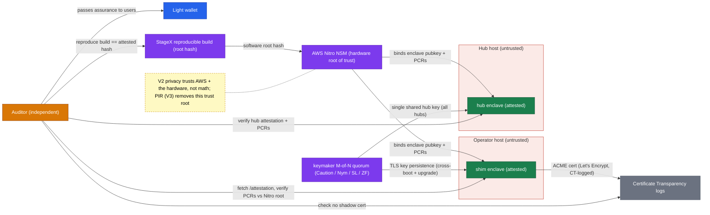

# Architecture

The deployable pieces of the [shim and hub](./components.md) system, why they are shaped this way, and two diagrams: the data flow, then the trust plane.

## The deployable pieces

Two new pieces of attested software plus a transport put an **attested, verifiable, tamper-proof front-end at every operator**, on which the [protections](./problem.md) rest and the whole [roadmap](./roadmap.md) builds. Five things run:

- **zero-indexer-shim (ZIS)**: a lightweight, attested router each operator deploys behind its existing public URL (for example `zec.rocks:443`). To every wallet it looks exactly like the indexer already there, so wallets need no reconfiguration. It forwards almost all traffic untouched to the operator's backing indexer, and isolates two things: transactions that **touch Orchard** (diverted to the hub) and `GetTransaction` (answered by the hub, so a wallet's lookup for its own migration never reaches the operator). Everything else passes straight through instantly; the backend still sees those contents, but arriving from the shim, not the wallet's IP. The shim is **stateless**, holding nothing about what it diverted, which is exactly why every `GetTransaction` must go to the hub.
- **zero-indexer-hub (ZIH)**: a central, attested service, designed to run as two or more instances with failover. It does two jobs. It **batches**: an Orchard-touching transaction is encrypted to a key the local operator cannot access, routed to a hub, batched with those from every other shim, and co-published on a strict block cadence after a short delay, so an observer holding "IP X connected at time T" cannot time-match it to the transaction when it appears on-chain. And it **answers lookups**: a `GetTransaction` is served from the hub's queue while the migration is unflushed (height 0, mempool), otherwise from the hub's own indexer.
- **Nym, embedded in both binaries** (deployed): each side links `nym-sdk` and runs its own mixnet client **in-process**, inside the enclave, so there are no proxy sidecars and no untrusted process on the path. It runs only between shim and hub, never wallet-to-shim. An attested pair has run it on the public mixnet since 2026-08-14; the clearnet dial remains in the code but is off at the hub by default ([roadmap](./roadmap.md) has the status table).
- **The operator's backing indexer**: the unmodified lightwalletd or Zaino the operator already runs, on its internal address. To it the shim is a single ordinary gRPC client. It serves block sync, address queries, and pass-through broadcasts in cleartext, exactly as today; a diverted Orchard-touching transaction and a wallet's `GetTransaction` never reach it.
- **The hub's indexer**: a CompactTxStreamer (lightwalletd or Zaino), distinct from any operator's, that the hub connects out to over TLS to read the chain tip, publish each flushed batch, and answer a `GetTransaction` its queue does not hold. Neither enclave runs a validator of its own. (In a single-operator deployment the two indexer roles can collapse onto one instance, which removes the lookup privacy but not the batching.)

## Why this shape: Orchard-touching only, and Option B

Orchard first, and only Orchard, is deliberate. The Orchard to Ironwood migration is the acute, mandatory, mass event, and it is not time-sensitive, exactly when batching helps most (a large simultaneous population to hide among) and costs the least (no urgency to broadcast). But the batched class is drawn wider than "migration": **every** transaction that touches Orchard is batched, whatever its value balance or destination. That is Zooko's rule, and the closed-pool argument behind it is in [the shim](./components.md).

Widening the class widens what is delayed, and the honest accounting is that it costs little. An Orchard deshield to transparent is now held for a flush window like a migration, and deshields are ordinarily time-sensitive commerce. But Orchard is closed to new value, so ordinary commerce lives in Ironwood and passes through untouched; what is left in Orchard is legacy balance, and moving legacy balance is not an urgent errand.

The topology is the all-hands call's "Option B": a drop-in shim in front of each operator plus central batching hubs, chosen after a more decentralized "Option C" was set aside. ("Option A," a standalone privacy server users must point their wallets at, is deferred: past experience says getting wallets to change their endpoint URL is nearly impossible.)

Everything else is post-launch: [roadmap](./roadmap.md) covers the deferred items, [honest limits](./trust.md) what this narrow scope does and does not buy.

---

## 1. Data flow and trust boundaries

*Diagram by Zooko Wilcox-O'Hearn ([zero-indexer-diagrams](https://github.com/zookoatshieldedlabs/zero-indexer-diagrams)), regenerated here with the Nym hop.*

**Reading it.** Green boxes are attested enclaves, the only things that ever see migration cleartext. Each shim links its mixnet client **in-process**, so there is no separate Nym node inside the TEE to draw: the shim itself emits Sphinx traffic. The mixnet is drawn outside both enclaves because the mix nodes are untrusted; it is 5-hop, and wallets never speak it. The grey edge from each shim to its own indexer is the **pass-through path**, plaintext the operator reads exactly as today; the green edge is the **diverted path** that bypasses the operator entirely. Both organisations' migrations enter the mixnet and one edge leaves it, which is the anonymity property: the hub cannot tell which shim a migration came from. Not drawn, because they would crowd the picture: `GetTransaction` is answered by the hub rather than the operator, and a second hub with failover is designed.

Two residuals the picture cannot show, both developed in [honest limits](./trust.md). The operator learns *that* one of its clients migrated, since a diverted transaction is the one request it does not see, though not the amount or which on-chain transaction. And the anonymity set is the batch itself, so at a batch of one there is nothing to hide among.

**Three nested encryption layers are designed for the migration (shim to hub) path**, so that only the two attested enclaves ever see cleartext. **The deployed hop today has the outer layer only**: Sphinx across the mixnet, with the wallet's own TLS terminated by the platform's in-enclave proxy before it.
1. **Inner** (designed): the tx is encrypted to the **hub key** at the classifier, so it survives a compromised host.
2. **Middle** (designed): **STEVE** (AES-256-GCM) terminates inside the hub enclave.
3. **Outer** (deployed): **Nym** Sphinx across the 5-hop mixnet.

---

## 2. Trust, attestation, and verification plane

The **keymaker M-of-N quorum** persists keys across cold boots and upgrades and hands the **single shared hub key** to every hub instance, which is what makes failover clean. The **Auditor Role** is open to any independent party. The shim's one-way **STEVE** handshake performs this same enclave-verification against the hub, automatically and per session.

STEVE mechanics and the honest limits are in [trust](./trust.md).
