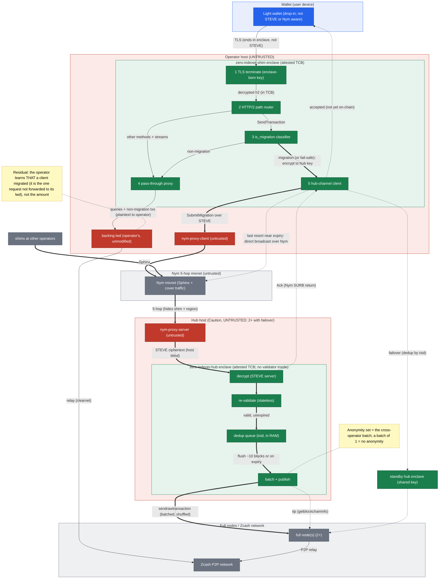
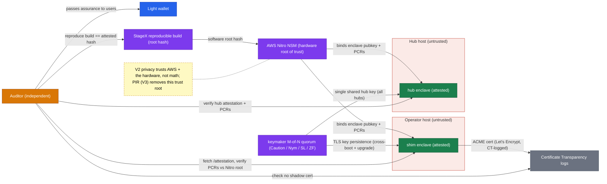

# Architecture

The [zero-indexer-shim and zero-indexer-hub](./components.md) system that stops **Orchard exits**, any transaction moving value out of the Orchard pool (typically but not only the Orchard to Ironwood migration), from leaking a user's IP. See [introduction](./introduction.md) for the actors around it and [trust](./trust.md) for the trust chain. This chapter is the pieces you deploy and how they converse, then two diagrams: the data flow, then the trust / verification plane (kept separate for readability).

## The deployable pieces

Two new pieces of attested software plus a transport put an **attested, verifiable, tamper-proof front-end at every operator**, on which the [protections](./problem.md) rest and the whole [roadmap](./roadmap.md) builds. Five things run:

- **zero-indexer-shim (ZIS)**: a lightweight, attested router each operator deploys behind its existing public URL (for example `zec.rocks:443`). To every wallet it looks exactly like the indexer already there, so wallets need no reconfiguration and no new endpoint URL. It forwards almost all traffic, untouched, to the operator's own unmodified backing indexer, and isolates only transactions that move value **out of the Orchard pool**. Everything else (every query, and every broadcast that leaves Orchard untouched: transparent payments, intra-pool shielded payments, shields, deshields from other pools) passes straight through instantly, not indexed and not delayed; the backend still sees the *contents*, but arriving from the shim, not the wallet's IP.
- **zero-indexer-hub (ZIH)**: a central, attested batching service, run as two or more instances with failover. An Orchard exit (typically the Orchard to Ironwood migration) is encrypted to a key the local operator cannot access, routed over Nym to a hub, batched with exits from every other shim, and co-published to the Zcash network on a strict block cadence after a short delay, so an observer holding "IP X connected at time T" cannot time-match it to the transaction when it later appears on-chain.
- **Nym, and its two proxy sidecars**: `nym-proxy-client` on the shim side, `nym-proxy-server` fronting the hub. Nym runs only between shim and hub, never wallet-to-shim. Both sidecars move only ciphertext, so both are untrusted.
- **The operator's backing lwd**: the unmodified lightwalletd or Zaino the operator already runs, on its internal address. To it the shim is a single ordinary gRPC client. It serves every query and every pass-through broadcast in cleartext, exactly as today; a diverted Orchard exit never reaches it.
- **Full nodes**: two or more existing zebrad or zcashd nodes the hub connects out to over clearnet, for the chain tip and to broadcast each flushed batch. Neither enclave runs a validator of its own.

## Why this shape: Orchard exits only, and Option B

Orchard first, and only Orchard, is deliberate. The Orchard to Ironwood migration is the acute, mandatory, mass event, and it is not time-sensitive, exactly when batching helps most (a large simultaneous population to hide among) and costs the least (no urgency to broadcast). But the batched class is drawn one step wider than "migration": **every** transaction moving value out of Orchard is batched, whatever pool the value lands in. That is Zooko's rule, and the reason is that NU6.3 closes Orchard to new value, so anyone still spending Orchard is spending legacy funds and the spend itself is the identifying event, whatever its destination ([the shim](./components.md) has the predicate and the argument). Shields and deshields from other pools still pass straight through: a shield is privacy-positive already, since the transparent side is public, and a deshield out of Ironwood or Sapling says nothing about legacy Orchard holdings.

Widening the class widens what is delayed, and the honest accounting is that it costs little. An Orchard deshield to transparent is now held for a flush window like a migration, and deshields are ordinarily time-sensitive commerce. But Orchard is closed to new value, so ordinary commerce lives in Ironwood and passes through untouched; what is left in Orchard is legacy balance, and moving legacy balance is not an urgent errand. The batched set stays a policy knob that can widen or narrow later without re-architecting.

The topology is the all-hands call's "Option B": a drop-in shim in front of each operator plus central batching hubs, chosen after a more decentralized "Option C" was set aside. ("Option A," a standalone privacy server users must point their wallets at, is deferred: past experience says getting wallets to change their endpoint URL is nearly impossible.) The scope is intentionally minimal:

- Nym only between shim and hub, not wallet-to-shim.
- Orchard exits only (the classifier detects every turnstile crossing; only exits from Orchard are batched).
- At least two attested hubs with shim failover, so a hub outage never stalls migrations.

Everything else (the attested Nym fleet, the standalone privacy server, the query-only/broadcast-only split, PIR, and full consortium key governance) is post-launch. [Roadmap](./roadmap.md) covers the deferred items; [honest limits](./trust.md) states what this narrow scope does and does not buy.

---

## 1. Data flow and trust boundaries

**Reading it:** *migration* in both diagrams is the code's label for the diverted class, which is every **Orchard exit**, any transaction taking value out of the Orchard pool whatever its destination ([the shim](./components.md) has the predicate). Thin arrows = the **pass-through path** (all queries and all non-migration txs), which go to the operator's unmodified backing lwd as **plaintext the operator can read**, exactly as today. Thick arrows = the **migration path**: encrypted end to end and **never touches the backing lwd**. Green = attested enclave processes (the only things that ever see migration cleartext); red = untrusted host processes / sidecars (they see only ciphertext on the migration path); gray = external networks; blue = the drop-in wallet.

**Three nested encryption layers on the migration (shim to hub) path**, so only the two attested enclaves ever see cleartext:
1. **Inner:** the tx is encrypted to the **hub key** at the classifier (survives a compromised Nym client or host).
2. **Middle:** **STEVE** (AES-256-GCM) terminates inside the hub enclave.
3. **Outer:** **Nym** Sphinx across the 5-hop mixnet.

---

## 2. Trust, attestation, and verification plane

Each enclave generates its key in-enclave and binds the public key into the **Nitro attestation** (root hash from the reproducible **StageX** build). The **keymaker M-of-N quorum** persists keys across cold boots and upgrades, and hands the **single shared hub key** to every hub instance (what makes failover clean). The **Auditor Role** is any independent party: verify the attestation + PCRs against the AWS Nitro root, and check **Certificate Transparency** that no shadow cert exists for the domain. The shim's one-way **STEVE** handshake performs this same enclave-verification against the hub.

STEVE mechanics, the honest limits (operator learns THAT not the amount, cross-operator anonymity set, delayed broadcast, retain-until-confirmed, AWS-not-math trust root, hub failover), and the open questions for Anton (Caution) live in [trust](./trust.md) and [review](./review.md).
