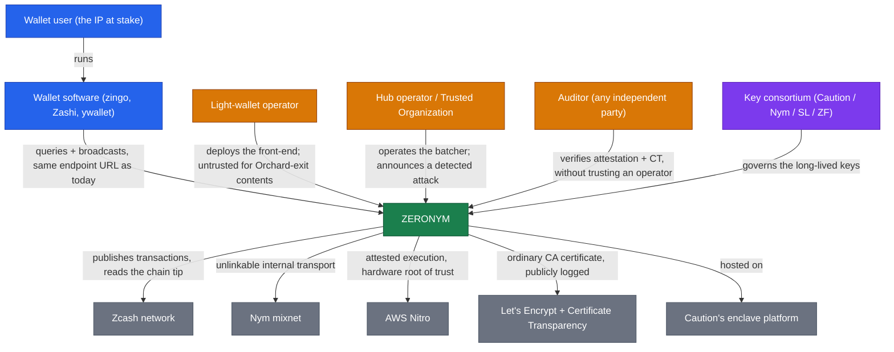

# Introduction

Zeronym is privacy for Zcash light wallets, a Shielded Labs product named by Jason McGee Stramaglia: a play on "pseudonym," zero + nym. The name encodes two pillars:

- **zero**: zero-leak indexing. A light wallet should sync and transact without handing an indexer the raw material to deanonymize it.
- **nym**: the [Nym](./glossary.md) mixnet, the transport that unlinks a wallet's traffic from its source IP and region.

Today a Zcash light wallet leaks. Under the ZIP 307 light-client protocol it talks to an indexer over clearnet, so the operator sees the wallet's source IP and the timing of everything it does. [The problem and threat model](./problem.md) lays out that leak and its worst instance, the Orchard to Ironwood migration, which Zooko called the worst privacy-loss event in Zcash history.

## Near-term and long-term

Two efforts share a name and a direction but not a scope.

**The near-term system** is urgent and narrowly scoped: stop transactions that take value out of the Orchard pool, starting with the Orchard to Ironwood migration, from leaking a user's IP. It targeted a soft ~Aug 10 deadline (a joint Nym and Shielded Labs blog post promised a mechanism by then). It is a small, attested system, deliberately an 80% first step, honest about the 20% it does not cover. The shim and the hub are built and run as attested enclaves; the Nym hop, STEVE, and the key consortium remain design (see [the shim and the hub](./components.md) and [roadmap](./roadmap.md) for status).

**The long-term vision** is the fuller product the name promises: a wallet-facing private indexer serving queries, not just broadcasts, over Nym, terminated inside an attested enclave, with PIR added later as a hardware-independent layer. That arc is deferred until the migration fix ships. [Roadmap](./roadmap.md) traces the three versions (V1 Nym, V2 +TEE, V3 +PIR). Most of this book is the near-term system, because that is what is being built now.

## The system in its world

Seen from outside, Zeronym is one thing: an attested front-end that a wallet talks to exactly as it talks to an indexer today, and that publishes the transactions most at risk on someone else's schedule rather than the sender's. Who touches it, and what it touches:

## The cast

- **The wallet user.** The person whose IP address is what is at stake. They install nothing, change no setting, and point their wallet at the same endpoint URL as before.
- **The wallet software** (zingo, Zashi, ywallet, and the rest). Needs no reconfiguration and no new endpoint, but must choose **aligned anchors and expiry heights** within a migration epoch, the [ZIP 318](https://zips.z.cash/zip-0318) behavior. That is the one thing asked of wallets, and it is a hard requirement, not a nicety ([the problem](./problem.md) explains why a latest-anchor wallet re-links itself).
- **The light-wallet operator.** One of the roughly five to ten organizations running a public indexer today. Each deploys Zeronym's front-end behind its own existing URL, in front of its own unmodified indexer. An operator is **untrusted** for the contents of an Orchard exit, and still sees the contents of every ordinary query.
- **The hub operator, also the Trusted Organization.** Runs the central batching service (Caution at launch), and separately performs the **detection** role: verifying the front-end's attestation, monitoring Certificate Transparency, and **publicly announcing** that it has detected signs of an attack. Untrusted for contents; relied on for liveness and for detection.
- **The auditor.** Any independent third party, in practice often a wallet developer auditing once on behalf of all its users. Verifies the attestation and the CT logs and reproduces the build, **without trusting the operator** ([trust](./trust.md) has the steps).
- **The key consortium.** Caution, Nym, Shielded Labs, and the Zcash Foundation, holding the long-lived keys as an M-of-N quorum so that no single party, not even the hub operator, controls them.

Five outside systems carry the rest: the **Zcash network**, where transactions are finally published; the **Nym mixnet**, the internal transport; **AWS Nitro**, the attested execution environment and hardware root of trust; **Let's Encrypt and the Certificate Transparency logs**, which give a wallet an ordinary certificate and give an auditor a public record if a second one ever appears; and **Caution's platform**, which hosts the attested services.

## How to read this book

Roughly in order, the chapters move from the outside in.

- [The problem and threat model](./problem.md): the leak, the migration event, the adversaries, what the attested edge protects, and what stays out of scope.
- [Architecture](./architecture.md): the deployable pieces and why they are shaped this way, the data-flow and trust diagrams, and the three encryption layers.
- [The shim and the hub](./components.md): what is inside each piece, down to the classifier predicate and the code it lives in.
- [Trust and honest limits](./trust.md): the deep dive on Nitro attestation, the STEVE handshake, and the key quorum, and what the system does not do.
- [Roadmap](./roadmap.md) and [Open questions and review](./review.md) look forward; the [Glossary and references](./glossary.md) collects the terms and sources.

Written in the Zcash design-book tradition: clean, direct, and honest about its limits. Where the near-term system stops short of the vision, it says so.
