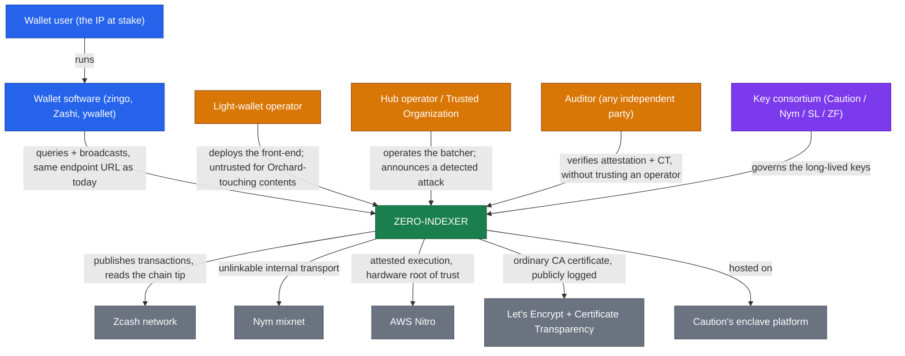

# zero-indexer

Privacy for Zcash light wallets: an attested front-end that stops pool-crossing transactions from leaking your IP.

Today a Zcash light wallet leaks. Under the ZIP 307 light-client protocol it talks to an indexer over clearnet, so the operator sees the wallet's source IP and the timing of everything it does. zero-indexer is a Shielded Labs product built on two pillars: **zero-leak indexing**, so a wallet can sync and transact without handing an indexer the raw material to deanonymize it, and the **[Nym](./glossary.md#nym) mixnet**, the transport that unlinks a wallet's traffic from its source IP and region.

Two efforts share the name. **The near-term system** is urgent and narrowly scoped: stop transactions that touch the Orchard pool, starting with the Orchard to Ironwood migration, from leaking a user's IP. It is deliberately an 80% first step, honest about the 20% it does not cover, and it is deployed. **The long-term vision** is the fuller product: a wallet-facing private indexer serving queries, not just broadcasts, over Nym, terminated inside an attested enclave, with PIR added later as a hardware-independent layer. Most of this book is the near-term system, because that is what is running now.

A note on names, since they do not match. The product is **zero-indexer**; the repository is [`ShieldedLabs/zero`](https://github.com/ShieldedLabs/zero) and the directory is `zeronym/`, both from the project's former name, Zeronym. The components keep the product name: `zero-indexer-shim` and `zero-indexer-hub`.

## Table of Contents

- [Security](#security)
- [Background](#background)
- [Install](#install)
- [Usage](#usage)
- [The cast](#the-cast)
- [Maintainers](#maintainers)
- [Thanks](#thanks)
- [Contributing](#contributing)
- [License](#license)

## Security

This book is written to be checked, not taken on faith. If you are here to review the architecture, start with these.

- **What is protected.** The migration broadcast: its contents are hidden from the operator, and the transaction that appears on-chain carries no link to the wallet's IP, because the hub publishes it rather than the wallet. [The problem and threat model](./problem.md) has the threat table, row by row.
- **What is not.** Query content still reaches the operator: which addresses a wallet looks up is not protected, with one exception (`GetTransaction`, now answered by the hub). The operator still learns *that* one of its clients migrated, though not the amount or which transaction. Batch-timing anonymity is conditional on adoption and at today's volumes the modal batch is one, which is no anonymity at all. [Trust and honest limits](./trust.md) develops each of these, with the arithmetic.
- **What the trust rests on.** AWS Nitro and the hardware, not mathematics. That is a deliberate near-term choice; PIR is the step that removes it ([roadmap](./roadmap.md)).
- **What is not yet verifiable.** The enclaves are attested and running, but the deployed pair's published provenance does not currently check out, and both reproduce jobs fail at tip of main. Until that closes, do not describe the system as independently verifiable. The [status table](./roadmap.md) is the one place that is tracked.

Security issues in the code should go to Shielded Labs privately rather than into a public issue.

## Background

A light wallet delegates chain validation to an indexer and speaks to it over [ZIP 307](https://zips.z.cash/zip-0307). The protocol gets note privacy right and metadata privacy wrong: the indexer terminates the wallet's connection, so it sees the source IP, the timing of every request, and the addresses queried. Joined against the public chain, that links a network identity to an on-chain balance.

The acute case is the mandatory Orchard to Ironwood migration, which Zooko called the worst privacy-loss event in Zcash history: a large population each broadcasting at least one pool-crossing transaction inside a bounded window, every one of them joinable. [The problem and threat model](./problem.md) is the full argument; [architecture](./architecture.md) is the shape of the answer.

## Install

For **indexer operators**, who are the people who deploy this. The shim is a drop-in: it sits behind your existing public URL, in front of your existing unmodified indexer, and wallets need no reconfiguration.

The operator runbook is [`zeronym/shim/deploy/caution/OPERATORS.md`](https://github.com/ShieldedLabs/zero/blob/main/zeronym/shim/deploy/caution/OPERATORS.md), which covers prerequisites, deploy, verify, and the config reference end to end. A third-party operator has run it start to finish. Read [the shim and the hub](./components.md) first if you want to know what you are running before you run it.

To read this book locally rather than on the web:

```
cargo install mdbook mdbook-mermaid
mdbook-mermaid install zeronym/book
mdbook serve zeronym/book --open
```

## Usage

Four audiences, four different answers.

- **Wallet users** install nothing and change no setting. You point your wallet at the same endpoint URL as before.
- **Wallet developers** have exactly one requirement, and it is a hard one: choose **aligned anchors and expiry heights** within a migration epoch, the [ZIP 318](https://zips.z.cash/zip-0318) behavior. A latest-anchor wallet re-links itself through its anchor and undoes the protection ([the problem](./problem.md) explains why).
- **Operators** run the shim in front of their indexer and, optionally, a hub. Orchard-touching transactions and `GetTransaction` lookups stop being your problem to see; everything else passes through as it does today.
- **Auditors** verify an endpoint without trusting its operator: fetch its attestation, check the PCRs against the AWS Nitro root, reproduce the build, and check Certificate Transparency for a shadow certificate. [Trust and honest limits](./trust.md) has the steps and the current caveats.

## The cast

Seen from outside, zero-indexer is one thing: an attested front-end that a wallet talks to exactly as it talks to an indexer today, and that publishes the transactions most at risk on someone else's schedule rather than the sender's.



| Actor | Role | Trusted for |
|---|---|---|
| **Wallet user** | The person whose IP is at stake. Installs nothing, changes no setting | n/a |
| **Wallet software** | zingo, Zashi, ywallet and the rest. No reconfiguration, but must choose aligned anchors and expiry heights within a migration epoch | n/a |
| **Light-wallet operator** | One of roughly five to ten organizations running a public indexer. Deploys the front-end behind its own URL, in front of its own unmodified indexer | **Untrusted** for Orchard-touching contents. Still sees ordinary query contents |
| **Hub operator / Trusted Organization** | Runs the central batching service (Caution at launch) and performs **detection**: verifying attestation, monitoring CT, and **publicly announcing** signs of an attack | Untrusted for contents; relied on for liveness and detection |
| **Auditor** | Any independent party, in practice often a wallet developer auditing once for all its users | Verifies **without trusting the operator** |
| **Key consortium** | Caution, Nym, Shielded Labs, the Zcash Foundation | Hold the long-lived keys as an M-of-N quorum, so no single party controls them |

## Maintainers

[Shielded Labs](https://shieldedlabs.net), in [`ShieldedLabs/zero`](https://github.com/ShieldedLabs/zero).

## Thanks

The publication diagrams in [the problem](./problem.md) and [architecture](./architecture.md) are by Zooko Wilcox-O'Hearn, from [zero-indexer-diagrams](https://github.com/zookoatshieldedlabs/zero-indexer-diagrams). Caution builds the enclave platform, StageX, and STEVE. Nym operates the mixnet.

## Contributing

Issues and pull requests go to [`ShieldedLabs/zero`](https://github.com/ShieldedLabs/zero). The cross-party questions still open with Caution are tracked in [`zeronym/OPEN-QUESTIONS.md`](https://github.com/ShieldedLabs/zero/blob/main/zeronym/OPEN-QUESTIONS.md) rather than in this book.

Review of the architecture itself is the contribution most wanted right now. The [Security](#security) section above lists what to attack first.

## License

**No license is currently declared.** The repository carries no `LICENSE` file, so default copyright applies and no reuse rights are granted. That is an oversight rather than a position, and it needs resolving before this is treated as open source.
