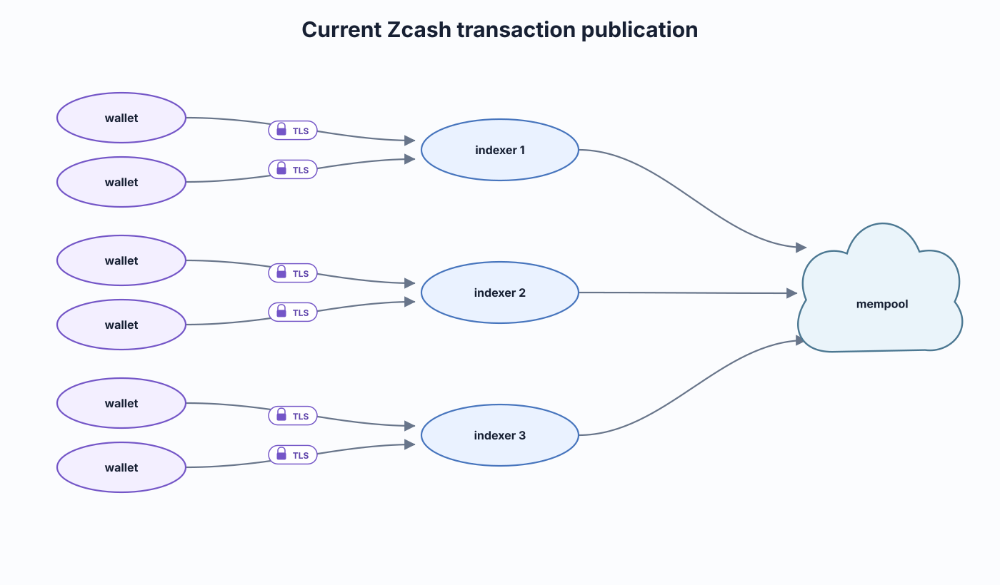

# The problem and threat model

Zcash's shielded pools hide the sender, receiver, and amount of a transaction on-chain. They do not hide the network metadata a light wallet exposes when it talks to the server that indexes the chain for it: the wallet's source IP address and the timing of its requests. For most traffic that is a background privacy cost. For a transaction that crosses a value-pool boundary, and above all for the mandatory Orchard to Ironwood migration, it is enough to link a real-world network identity to an on-chain balance. zero-indexer's near-term system (the [zero-indexer-shim and zero-indexer-hub](./components.md), with Nym between them) targets exactly one half of that leak: the migration **broadcast**.

This chapter describes the system in the present tense. The shim and hub are deployed as attested enclaves, a real migration ran the full stack on mainnet on 2026-08-11, and the shim-to-hub hop has run over the Nym mixnet since 2026-08-14. Per-mechanism status, including what is not yet independently verifiable, is the table in [the roadmap](./roadmap.md).

## The ZIP 307 light-client leak

A light wallet delegates chain validation to an indexer (lightwalletd or Zaino) over [ZIP 307](https://zips.z.cash/zip-0307)'s CompactTxStreamer gRPC service: it pulls compact blocks, trial-decrypts them locally to find its own notes, and submits its transactions back through the same indexer.

The protocol gets one half right and the other half wrong. Note contents stay private, since trial decryption is client-side and the indexer never learns which notes are yours. Metadata does not: the indexer terminates the connection, so it sees the source IP, the timing of every request, and the addresses and block ranges queried (ECC and ZecSec have written this up, see [the glossary](./glossary.md)).

The near-term system targets the **broadcast** half. When a wallet submits a transaction it calls SendTransaction on the indexer over clearnet TLS; the operator terminates that TLS and sees the raw transaction bytes, the source IP, and the arrival moment.

*Diagram by Zooko Wilcox-O'Hearn ([zero-indexer-diagrams](https://github.com/zookoatshieldedlabs/zero-indexer-diagrams)).*

The TLS in that picture is doing less than it looks. It protects the transaction from everyone except the party that matters, because it terminates *at* the indexer, which is exactly the party positioned to log the source IP and join it to the chain. [Architecture](./architecture.md) redraws this with the shim and hub in place. The other half, which addresses a wallet looks up, is the **query** leak, still largely out of near-term scope, with one exception now closed: transaction-detail lookups (`GetTransaction`) are served by the hub's indexer rather than the operator's (see [the roadmap](./roadmap.md)).

## From metadata to balance: the correlation

A source IP and a timestamp are only metadata until they join to something; turnstile-crossing transactions supply the join. A transaction that moves value across a value-pool boundary reveals that movement in cleartext on the public chain (for a deshield, the receiving transparent output too). So an operator, or anyone who later obtains its logs, holds two halves of a linkage:

1. From connection logs: source IP X submitted a broadcast at time T.
2. From the public chain: a turnstile-crossing transaction moving amount Y appeared at roughly time T.

Joining the two by timing links **IP address to on-chain transaction to balance**. Nothing in the shielded cryptography prevents this: the leak is in the transport, not the transaction. It is a retrospective attack as much as a live one, because the public chain is permanent and connection logs can be kept and joined later.

## The acute event: the Orchard to Ironwood migration

Ironwood is the new shielded pool; to migrate, a wallet must broadcast a transaction moving value out of the Orchard pool and into Ironwood. Sent the way light wallets send transactions today, every one exposes a source IP and a timestamp joinable to the resulting on-chain migration. Zooko framed this on the 2026-07-30 all-hands as **the worst privacy-loss event in Zcash history**: users linking their IP address to their Zcash balance, hourly, for the duration of the migration window.

Migrations are the acute case for three compounding reasons:

- **Mandatory:** users cannot opt out to protect themselves; the value has to move.
- **Mass:** a large population migrates, so the leak is broad rather than isolated.
- **Concentrated:** the window is bounded, so many correlatable broadcasts land close together in time.

Those same properties make migrations the ideal thing to protect first: a mandatory, non-urgent mass of transactions can be batched and published together ([the architecture](./architecture.md)).

## Every turnstile crossing leaks

The migration is the acute driver, but the underlying leak is general. Any **turnstile crossing** (a transaction that moves value across a value-pool boundary) is revealed on-chain and, linked to a source IP, deanonymizes the user. Three shapes:

- **Deshield:** shielded value moving to a transparent output.
- **Shield:** transparent input moving into a shielded pool.
- **Migration:** shielded value moving from one shielded pool into a different shielded pool (Orchard to Ironwood).

The shim's classifier detects **every** crossing, but what it isolates is drawn by pool, not by crossing shape: near-term it protects every transaction that **touches Orchard**, and everything else passes straight through. So an Orchard-to-transparent deshield is batched exactly like an Orchard-to-Ironwood migration, while shields and deshields out of any other pool pass through ([the shim](./components.md) has the predicate and the argument for drawing the line there). Deshield and shield crossings exist on mainnet today, independent of Ironwood, so the leak is real for current mainnet traffic, not only for the future migration.

## The adversaries

Against the migration broadcast as it works today (clearnet), three adversaries can perform the IP-to-balance linkage:

- **The light-wallet operator (indexer).** Roughly five to ten operators run the light-wallet backends (lightwalletd or Zaino). Each terminates its clients' TLS, so today it sees the migration transaction in cleartext, the source IP that submitted it, and the timing, and can log all three and join them to the public chain at leisure. This is the primary adversary the near-term system is built to blind.
- **A passive network observer.** Anyone on the path between wallet and operator (an ISP, a transit provider, a hosting network) sees the connection metadata: which IP contacted the operator and when. Even without the transaction contents, the timing plus the public chain is enough to correlate.
- **The retrospective correlator.** Because the public chain is permanent and logs persist, any party that later obtains operator logs or network captures can perform the same join after the fact. The window for this attack does not close when the migration does.

## The migration-broadcast threat table

This model is deliberately narrow: the **migration broadcast path**, and explicit about everything that passes through unprotected. **Verifiable** means the wallet can check the property cryptographically via attestation, not merely trust that it holds. See [architecture](./architecture.md) for the encryption layers and [trust](./trust.md) for how attestation works.

| Property (migration broadcast) | Today (clearnet) | zero-indexer (shim + hub) |
|---|---|---|
| Migration tx contents hidden from the **operator** | No | Yes (encrypted; the TEE shim keeps the operator blind) |
| Migration broadcast **linkable to source IP** | Yes, linkable | No: the hub publishes, so the on-chain tx carries no wallet IP. The Nym hop additionally hides *which operator* a migration came from, and is built but not deployed |
| **Timing** of the broadcast correlatable to an exposed IP | Yes | **Only above a batch size of one.** Batching breaks the link at scale and does nothing at all when a flush publishes a single transaction; see below |
| Migration tx contents hidden from the **hub** | n/a | Yes (the hub is an attested TEE; Caution stays blind) |
| Guarantee is **verifiable** by the wallet | No | Yes (attested shim + hub) |
| **Query** *content* privacy (which addresses you look up) | No | **No** (content passes through; but requester IPs are blinded, see below) |

Two rows need more than a cell.

- **Timing correlatable.** Today the broadcast arrives at a moment the operator records, matching the on-chain appearance. Under zero-indexer the hub accumulates migrations from every shim and publishes them together on a block cadence, so the on-chain publish time no longer matches any one wallet's submission time. **This row is conditional, and the condition is not currently met.** The protection is the batch, so it is worth exactly what the batch contains: at a batch of one there is nothing to hide among, and the shuffle, the simultaneous publish, Nym and the TEE all do nothing for that transaction's timing. An earlier draft of this table answered "No" flat, which overclaimed. At the migration volume measured on mainnet the modal batch is expected to be zero or one; [honest limits](./trust.md) gives the arithmetic and the adoption threshold at which the row becomes true.
- **Query privacy.** Largely unchanged. The system does not protect which addresses a wallet looks up (transaction-detail lookups by txid are now served by the hub's indexer, but address-level queries still pass through). This is the honesty anchor; the sections below cover it.

## Naive vs Nym-aware wallets

Most wallets today do not speak Nym; they reach the shim over ordinary TLS. The model must hold for such a wallet, but not for a *completely* unmodified one, as the next section explains.

- For a **naive TLS wallet**, TLS terminates inside the shim's enclave, so the operator cannot read the migration transaction. But the operator's own network still observed that "IP X connected at time T." What protects that wallet is the **batching at the hub**: by holding the migration and co-publishing it with others after a delay, the hub ensures the operator cannot time-match "IP X active at T" against the on-chain migration. This is precisely why the shim must be a TEE (to blind the operator to the contents) and why the hub must batch (to break the timing link for the majority of wallets that cannot hide their own IP).
- A future **Nym-aware wallet** could encrypt the migration end-to-end to the hub key and route it itself, so the shim would only forward, not decrypt. The near-term design is built so that path drops in later; near-term wallets are assumed naive.

The dependence on batching is the model's soft spot: batch-timing anonymity is only as strong as how many migrations land in a single flush window. The robust, volume-independent win is the IP unlinking from Nym; the batching is an additional layer whose strength varies with migration density. [Honest limits](./trust.md) treats this in full.

## The one wallet-side requirement: aligned anchors and expiry

The system needs no wallet reconfiguration and no new endpoint URL, but it does need one thing from the wallet software: within a migration epoch, wallets must choose **identical anchors and expiry heights**. This is the [ZIP 318](https://zips.z.cash/zip-0318) behavior (minus its network-anonymity defenses, which the shim and hub now supply instead). It is a hard requirement, not a nicety.

The reason is an **anchor-linkage attack**. A migration transaction commits to an *anchor*, a note-commitment-tree root that was current when the wallet built it. A wallet that uses the *latest* anchor stamps its transaction with a timestamp: an attacker who sees the shuffled epoch batch revealed on-chain can match each transaction's anchor to the moment it was current, then match that moment to the time a given IP submitted a migration. The batching's timing protection evaporates. Aligning anchors and expiries across the epoch removes the per-transaction timestamp, so all migrations in a batch look alike.

So the protection is for **ZIP-318-like wallets whose users have opted out of Tor or Nym**, not for completely unmodified wallets. Coordinating this requirement with wallet authors, and aligning the hub's batch granularity to the granularity at which wallets pick anchors and expiries, are open items.

## The query path: content passes through

The near-term system does not hide query *content*. The following reach the operator's existing backend in the clear, exactly as today:

- **Most queries.** Which addresses or block ranges a wallet looks up still goes straight to the operator's backend. The one exception: transaction-detail lookups (`GetTransaction`) are answered by the hub's indexer, not the operator's. The broader ZIP 307 query-content leak (address-level lookups) is not closed near-term; it is the deferred vision (see [the roadmap](./roadmap.md)).
- **Shields, and deshields that do not spend Orchard.** Crossings the classifier detects but does not batch, so their broadcast metadata leaks as today. A deshield **from Orchard** is batched.
- **All other broadcasts.** Transparent-to-transparent and pure intra-pool shielded payments are not crossings at all; they pass through instantly.

## What the attested edge protects

Two protections hold today, on top of the deployment primitive itself.

**1. Migration broadcasts, fully** (and every other Orchard-touching transaction, which gets the same treatment). A migration's content is hidden from both the operator and the hub host, its source IP is unlinked, and its timing is broken: the strong, end-to-end guarantee, row by row in the table above. The one residual, that the operator can tell *that* one of its clients migrated but not the amount, is the next section.

**2. The operator's indexer is blinded to requester IPs, by default and verifiably.** Because the shim proxies, every query that still reaches the operator's backing lwd arrives from the shim, on the operator's own host, never from a wallet's IP, so the operator's indexer logs no longer bind a source IP to a queried address, the linkage that sits in every lwd's logs today by default. (Transaction-detail lookups no longer reach the operator at all: `GetTransaction` is served by the hub's indexer.) And because the shim is attested, "we do not log the IP" is a checkable property, not a promise. This removes the *passive* IP-logging surface, where most real-world risk lives: breaches, subpoenas, careless or sold logs.

The honest boundary on protection 2: the wallet's IP still reaches the operator's *host* at the TCP layer (on Nitro the parent proxies all network into the enclave, and attestation covers the shim, not the parent). So a bad-faith operator can still capture IPs at the network layer and timing-correlate them against the shim-sourced query stream to re-link IP to query. It is a verifiable removal of the *default* leak, not a guarantee against an *active* operator; closing that gap needs the wallet over Nym (Nym-aware wallets) or query-timing shaping. [Honest limits](./trust.md) owns the residual discussion.

Beyond the two, the front-end is **tamper-proof and verifiable**: a wallet or auditor can confirm it is talking to exactly the attested shim code, not an operator-controlled impostor (see [trust](./trust.md)). And it is the **deployment vehicle for the vision**: query shaping, all-broadcast privacy, and eventually PIR can be added to the same attested edge and reach the same drop-in wallets (see [the roadmap](./roadmap.md)).

## The residual: the operator learns *that* a client migrated

One leak survives by construction, and the model names it rather than hide it. Because the shim is a drop-in in front of the operator's own backend, a migration is the single request the shim does **not** forward to the backing lwd, so an operator watching its own traffic can infer *that* a given source IP submitted a migration, and roughly when. It does **not** learn *which* on-chain transaction or *what amount*: the hub's batch mixes that client's migration with others' from operators it never sees. So the residual is "IP X migrated something," not "IP X migrated amount Y," which is why the table's source-IP row reads No for the amount even though the bare fact leaks.

This residual is inherent to the drop-in model, and it is why shim-side batching and shim-to-hub cover traffic are rejected as mitigations. [Honest limits](./trust.md) develops that argument.

## Defense-in-depth: detection, not prevention

This is an emergency defense-in-depth measure. It does not cryptographically *prevent* every attack; it makes the attacks that matter **detectable after the fact**, which raises their cost and risk. The detection rests on two observable facts: the shim's TLS key is bound into its attestation, and every legitimate certificate for the domain appears in Certificate Transparency logs.

A **Trusted Organization** (the party operating the hub) watches both. It verifies the shim's setup attestation (the private key lives only in the enclave, and no other certificate for the domain is still valid, ideally a fresh domain with no prior certificates), re-verifies whenever the certificate is renewed for any reason, makes anonymous requests to the public URL to confirm the attested key is the one actually served (at least for untargeted users), and monitors CT for any new certificate. If it sees a different public key in use, or a new key appear in CT, it **publicly announces that it has detected signs of an attack**.

The honest cost of a detection design: an operator's own mistakes are indistinguishable from an attack. If an operator loses the TEE's state and must recreate it, or accidentally lets Let's Encrypt auto-renew the certificate, that trips the alarm as a false positive. Operators must therefore run carefully (disable certificate auto-renewal, guard the enclave state) and accept that operational slips get announced as possible attacks.

The bar this clears is specific: the design aims to be secure against attacks that fall short of entering a new certificate into CT logs *and* fall short of fully compromising the TEE, including TEE attacks that rewind or replay enclave state, or that observe the enclave's memory-access patterns (both are open hardening items).

## What this does not defend against

Beyond the query leak (out of scope above) and the residual (above), two active attacks are out of scope, and one side channel constrains deployment:

- **Active wallet-tagging.** An attacker who can feed a target wallet a false chain can force it to build migrations against uniquely identifiable anchors; those transactions will not be valid, but they become uniquely findable in the revealed batch. An attacker can also hold a target back on the legitimate chain so it uses identifiably old anchors; the only visible symptom is that the user's incoming funds confirm much more slowly than usual. These are active wallet-breaking attacks, not passive observation, and this design does not stop them.
- **The transaction-size side channel.** An attacker can read a migration's size (its arity) from the TLS ciphertext length at submission time. If one migration in the revealed batch has a distinctive size, that IP is re-linked to it. So migration sizes must overlap across users; if they do not, the batching does not hide a large or unusual transaction.

A near-term deployment blocker sits alongside these: the existing TLS certificate for `zec.rocks` is valid through **October**, so until it expires (or a fresh domain is used, or the key is revoked and wallets check revocation), an attacker holding that certificate could still see targeted users' migrations.
