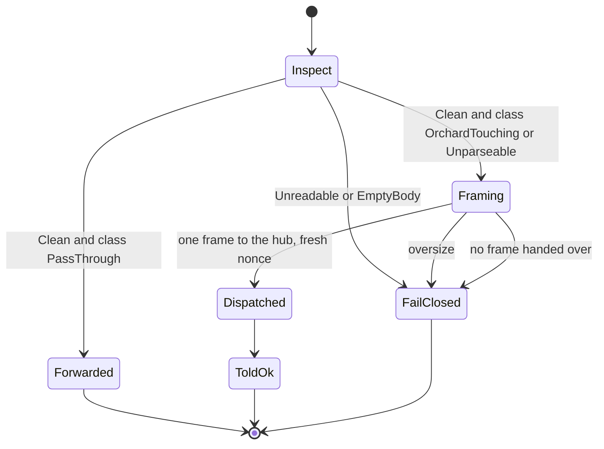
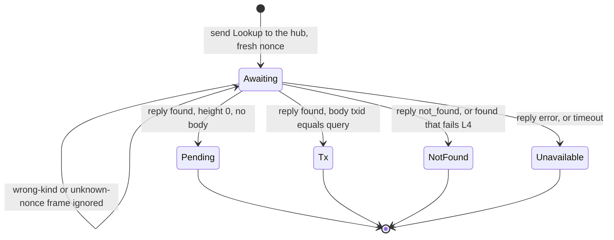
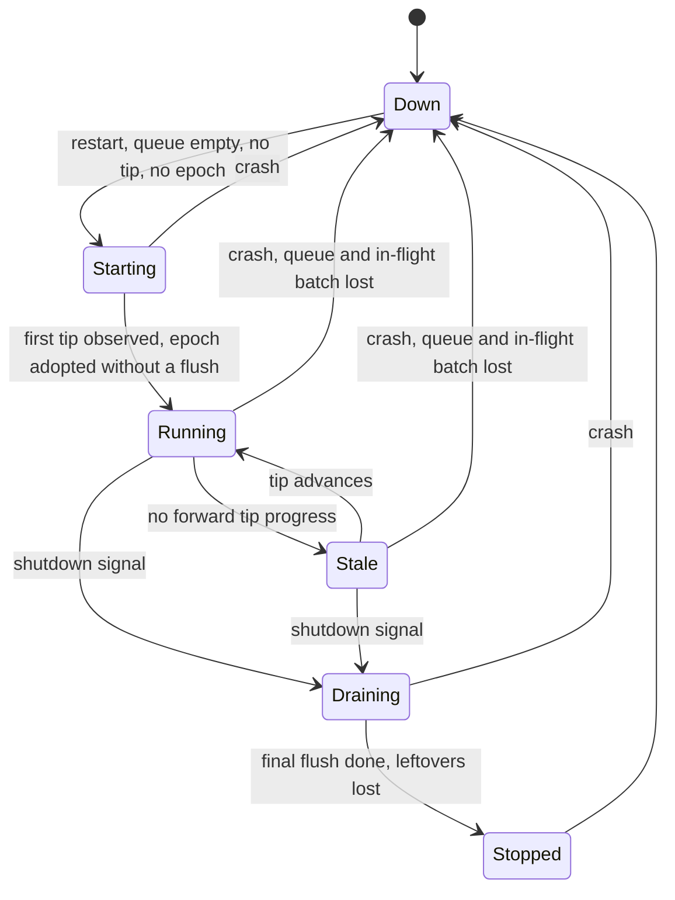
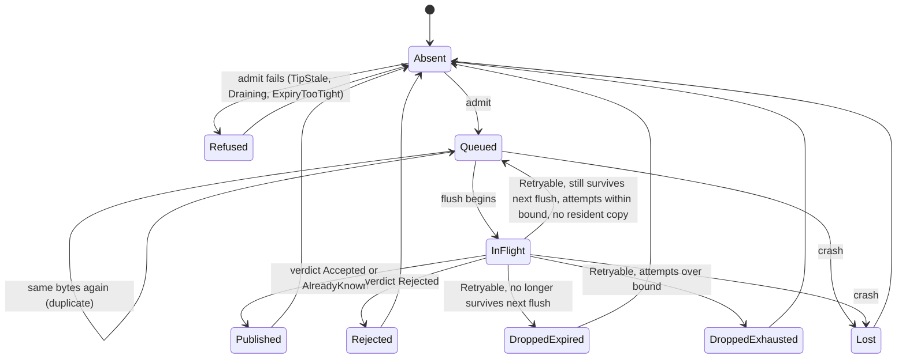
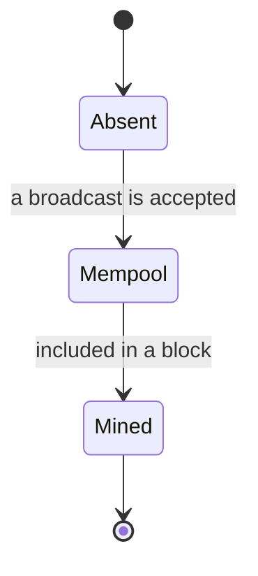
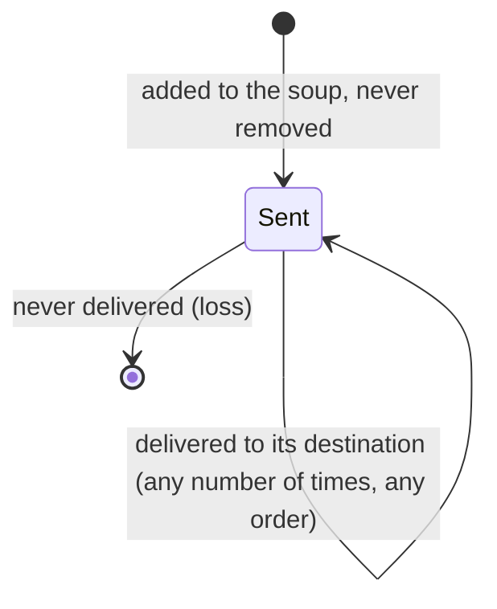
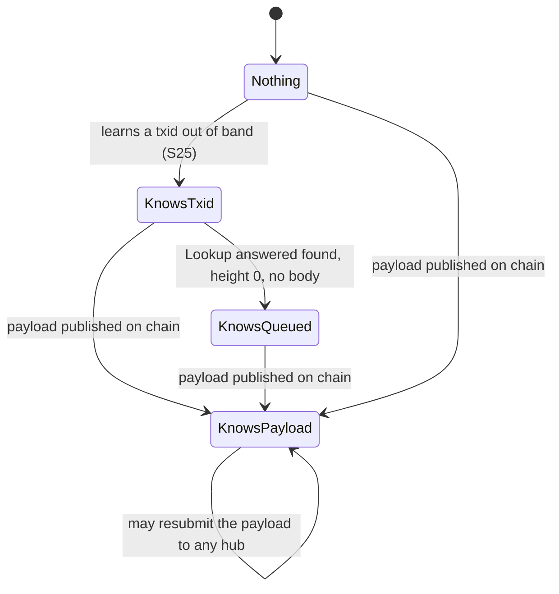
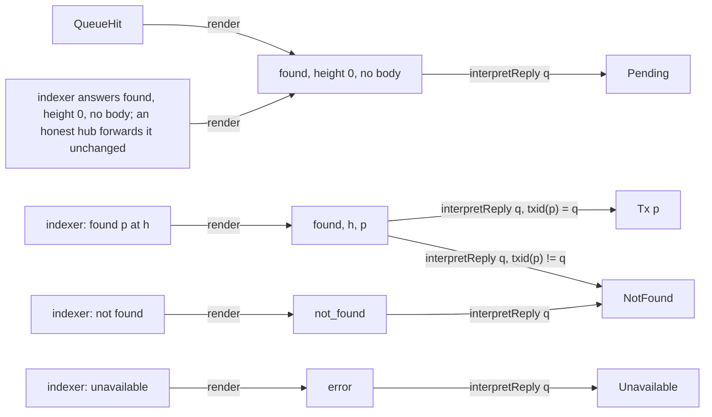
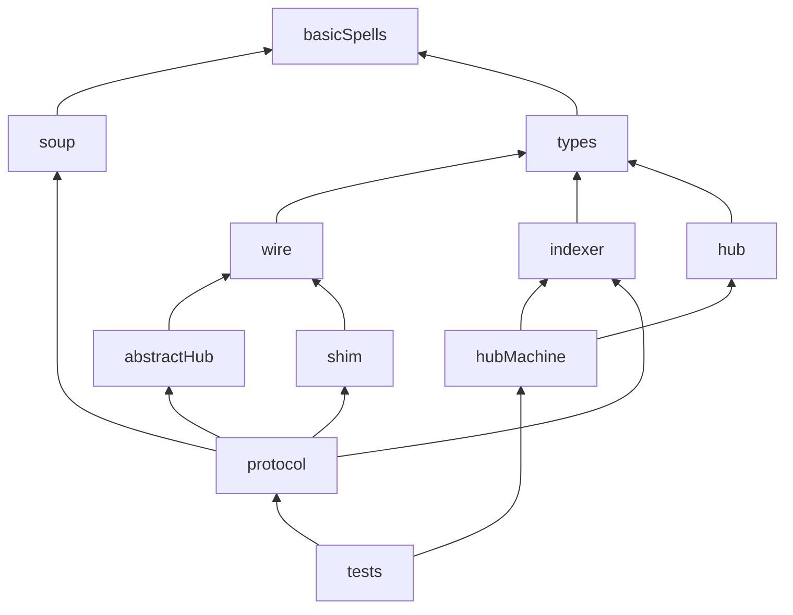

# The zeronym protocol, specified in Quint

A specification of the protocol between a wallet, the shim in front of an
operator's indexer, the hubs that batch diverted transactions, and the chain.
It is written from the protocol, not from the code's structure: it says what a
wallet can rely on, which components each guarantee trusts, where the known
gaps are, and it checks each of those statements.

It is separate from `zeronym/spec/divert.qnt`, which it does not replace or
modify.

## What "holds" means here

**Bounded random simulation.** Every "holds" below was produced by
`quint run`: fixed constants, at most 40 or 80 steps per trace, 2000
random traces per run, one seed. It is not a proof and it is not exhaustive to any
depth. A property that "holds" is one no sampled trace violated.

**`quint verify` has not been run** on any part of this specification. Tier 4
runs TLC on the hub specification through `tlc.sh`, not through `quint verify`.

Statements that do not rest on sampling are the ones backed by `quint test`:
the functional properties F1-F15 (F6 is cut) and the two-state properties A2-A3, which are
exhaustive over small finite universes, and the scripted runs, each of which
is one concrete execution.

## Running it

```sh
sh zeronym/spec/protocol/check.sh
```

Quint 0.33.0 is pinned (`npx --yes @informalsystems/quint@0.33.0` by default;
set `QUINT=quint` to use an installed one). Tier 4 needs Java (21 in CI) and Apalache 0.62.1, whose jar
carries TLC and which Quint fetches into `~/.quint` on first use; without
either the tier fails. `CHECK_TIERS=simulation` runs tiers 1 to 3b and
`CHECK_TIERS=tlc` tiers 1 and 4; CI runs them as two jobs, the TLC one with
`QUINT_JOBS=2 TLC_HEAP=6g TLC_TIMEOUT=900`.

| Tier | What | Command | Expectation |
|---|---|---|---|
| 1 | typecheck | `quint typecheck` on every file | ok |
| 2 | tests | `quint test` on the spells and every test file | all pass, and each file reports at least the count `check.sh` gives it |
| 3 | invariants | `quint run --invariants ... --max-samples=2000 --max-steps=40 --seed=7` | "holds" rows hold; the "fails" row is violated |
| 3b | witnesses | `quint run --witnesses ... --invariants ...` | every witness reached at least once; no invariant violated on the way |
| 4 | hub specification | `tlc.sh hubMachine.qnt hubMachine <init> <step> <invariant>`, one row each | "holds" rows hold over every reachable state; "violated" rows are violated, by a counterexample no longer than the recorded one |
Measured on the machine it was written on (Apple silicon, 16 cores, Quint's
Rust evaluator): about 10 minutes wall for all four tiers with four rows at
a time (`QUINT_JOBS=4`, the default), of which tiers 1 to 3 are about 2
minutes. It
has not been timed on a CI runner. `QUINT_SAMPLES` changes the trace count.
The rarest witness, W19 (`wThirdPartyServedBody`), is reached in 10 of the
2000 traces, so a lower count risks losing it.

The tier 3 "fails" row and tier 3b run under `step` or under a narrower
relation: `quietStep` (no faults, no outsiders), or `earlyLookupStep` (only
`early` sent and asked about, for G4's antecedent). Each is a part of `step`, so a
state or a violation found under it is reachable under `step`. Uniform random choice over `step`
rarely gets a transaction as far as a block in 40 steps; the narrower relations
do. Tier 3b re-checks each configuration's guarantees on those deeper traces.

## Threat model

What the specification is afraid of, who could cause it, and which property
answers it. The network can drop, duplicate, delay and reorder any message; it
cannot forge one. The shim is assumed honest (attested); see T18.

Threats the specification answers:

| # | Threat | Adversary | Answered by | Strength |
|---|---|---|---|---|
| T1 | The operator sees a migration's contents | Operator behind the shim | G1 | Simulation; depends on the shim alone |
| T2 | Someone obtains a queued migration's bytes and publishes it early, breaking the batch | Unauthenticated third party; Byzantine hub or indexer | G2 | Simulation; needs hub and indexer honest |
| T3 | The wallet is served a different transaction than the one it asked for | Byzantine hub or indexer | G3 | Survives a Byzantine hub or indexer; txid only, not bytes or height |
| T4 | The wallet is told something false about its transaction's status | Byzantine hub or indexer; network reordering | G4 | Simulation; needs hub and indexer honest; per answer, not across answers |
| T5 | A supported wallet's migration expires while the hub holds it | Chain timing; flaky tip; Byzantine hub or indexer | G6b, G6c | Exhaustive (TLC); fails under a stale tip |
| T8 | The hub silently drops or admits entries outside its rules | Hub implementation error | A2, A3, G7 | Exhaustive over hub states |

Threats the specification records but does not prevent:

| # | Threat | Where it is recorded |
|---|---|---|
| T6 | Any admitted transaction, including one from an unsupported wallet, is offered too late | Not checked. G6a and its gap K3 were removed; see [Out of the model](#out-of-the-model) |
| T9 | The wallet is told "sent" but the hub never admits it | Gap K1 |
| T10 | The wallet sees its transaction's status go backwards | Gap K2 |
| T11 | An acknowledged migration is lost to a crash, a failed final flush, or a requeue drop | Gap K5 |
| T12 | A third party who knows a txid learns it is queued | Accepted disclosure W8 |
| T13 | A lying indexer makes the hub flush early, shrinking the batch | Witness W15 |

Threats the specification does not model:

| # | Threat | Status |
|---|---|---|
| T7 | The hub acknowledges a migration it never queued | Not modelled: nothing reads an ack. G8 was removed |
| T14 | Linking a wallet to its migration by source IP | Claimed protected in the repository README; not in the specification |
| T15 | Linking by submission size and arrival time | Listed there as not protected; not in the specification |
| T16 | The operator recovering txid and value through transparent-pool queries | Listed there as not protected; not in the specification |
| T17 | Batch-size and timing anonymity; partitioning the anonymity set across hubs | Out of scope (timing and anonymity; more than one hub) |
| T18 | A compromised shim or enclave host | A compromised enclave host is delegated to AWS (`zeronym/README.md`, "Physical security is delegated to AWS"). A malicious shim build is assumed away by attestation and is not discussed there |

## Scope

### Protocol facts the specification rests on

| # | Fact | Source |
|---|---|---|
| S1 | Shim classifies `SendTransaction` by presence of Orchard actions; unparseable folds into "treat as migration" | `zeronym/shim/src/classify.rs:70-101`, `:246-248` |
| S2 | Shim-unparseable includes trailing bytes, which the hub's parser accepts, so "shim cannot parse" does not imply "hub computes no txid" | `zeronym/shim/src/classify.rs:269-283`, `zeronym/hub/src/queue.rs:281-289` |
| S3 | Divert arms: unreadable body fails closed; empty body INVALID_ARGUMENT; too large RESOURCE_EXHAUSTED; hub unreachable UNAVAILABLE; never the operator | `zeronym/shim/src/intercept.rs:180-283` |
| S4 | With a hub configured every `GetTransaction` goes to the hub; shim keeps no per-migration state | `zeronym/shim/src/intercept.rs:305-314`, `:58-64` |
| S5 | Lookup reply arms, in order: found/height 0/empty relayed as pending; found served only if the bytes' txid equals the query (L4), else NOT_FOUND; not-found; error fails closed | `zeronym/shim/src/intercept.rs:370-422`, `:453-466` |
| S6 | Two transports behind one enum: HTTP (verdict returned synchronously) and Nym | `zeronym/shim/src/hub.rs:277-328` |
| S7 | Nym submit is dispatch-only: success once one frame is handed over, fresh nonce per hub address, sent to every address; the ack is never awaited | `zeronym/shim/src/nym.rs:595-703` |
| S8 | Nym lookup tries addresses in turn; only a timeout moves on; fresh nonce per attempt | `zeronym/shim/src/nym.rs:708-797` |
| S9 | Correlation by nonce only; unknown nonce dropped; wrong reply kind for a known nonce ignored, waiter stays | `zeronym/shim/src/nym.rs:1040-1077`, `zeronym/hub/src/wire.rs:22-27` |
| S10 | Hub admit: tip-stale gate, then draining, too large, expiry survives next scheduled flush, payload-hash dedup, byte and entry budget. Admission never asks a node | `zeronym/hub/src/server.rs:343-392`, `:299-303`, `zeronym/hub/src/queue.rs:256-340` |
| S11 | Queue identity is `sha256(bytes)`; dedup is against resident entries only (`inner.entries.contains_key`), and a flush removes every entry (`inner.entries.drain()`); accepted entries are not put back. So bytes that were published are admitted again if resubmitted | `zeronym/hub/src/queue.rs:17-22`, `:308-310`, `:358-359`, `zeronym/hub/src/batcher.rs:389` |
| S12 | Hub lookup: queue first (found, height 0, no bytes), then indexer; unparseable entries never hit; flush window answers not-found, deliberately | `zeronym/hub/src/server.rs:403-462`, `zeronym/hub/src/queue.rs:455-475` |
| S13 | Lookup and submit to the hub are unauthenticated; the hub's Nym address is public with no ACL; the queue-hit reply discloses that a txid is queued | `zeronym/hub/src/server.rs:413-437`, `zeronym/hub/src/nym.rs:220-227` |
| S14 | Flush fires only when `cadence_height / flush_interval` exceeds the last flushed epoch; first observation adopts the epoch without flushing; shutdown flushes once more | `zeronym/hub/src/batcher.rs:316-335` |
| S15 | Flush drains everything, broadcasts, then: accepted / already-known leave; rejected dropped; retryable requeued | `zeronym/hub/src/batcher.rs:358-422`, `zeronym/hub/src/chain.rs:129-134` |
| S16 | Requeue: resident copy wins; attempts + 1; dropped if it no longer survives the next flush or attempts exceed 8; may overrun the byte budget; reports `held` / `dropped_expired` / `dropped_exhausted` | `zeronym/hub/src/queue.rs:186-199`, `:366-422`, `:96` |
| S17 | Tip is the max over answering endpoints; a regression within 10 blocks is followed; staleness stops admission only | `zeronym/hub/src/chain.rs:183-201`, `zeronym/hub/src/batcher.rs:161-205`, `:222-225` |
| S18 | Budget inequality `flush_interval + mining_margin + delivery_lag <= min_wallet_expiry` asserted at startup | `zeronym/hub/src/batcher.rs:93-118` |
| S19 | Drain closes admission before the final flush; the queue is RAM-only | `zeronym/hub/src/main.rs:142-177`, `zeronym/hub/src/queue.rs:226-243`, `zeronym/hub/src/batcher.rs:337-347` |
| S20 | Wire: four fixed-size frames; reply dispositions found / not_found / error; not_found or error with a payload is a decode error; `Draining` shares `QueueFull`'s code | `zeronym/hub/src/wire.rs:29-59`, `:278-290`, `:531-569` |
| S21 | Hub drops lookups past 64 in flight, replies older than 60 s, acks when the driver queue is full | `zeronym/hub/src/nym.rs:54`, `:75`, `:171-213`, `:285-292` |
| S22 | Indexer lookup answer is forwarded verbatim, so a zero `RawTransaction` is byte-identical to the queue-hit sentinel | `zeronym/hub/src/server.rs:445-451`, `zeronym/hub/src/chain.rs:284-290` |
| S23 | No attestation or STEVE handshake exists in code | `zeronym/README.md:88` |
| S24 | Replicate, never fail over: every hub that receives a migration queues and broadcasts it | `zeronym/README.md:86`, `zeronym/shim/src/nym.rs:602-647` |
| S26 | Shipped constants: `FLUSH_INTERVAL_BLOCKS = 20`, `MINING_MARGIN = 4`, `MAX_DELIVERY_LAG = 6`, `MIN_WALLET_EXPIRY = 40`, `REORG_ALLOWANCE = 10`. The slack `40 - (20 + 4 + 6) = 10` equals the reorg allowance exactly. `BatchParams::validate` asserts only the three-term sum; nothing asserts the four-term one | `zeronym/hub/src/batcher.rs:40-59`, `:101-113` |
| S27 | Lookup starts at a rotating cursor, so consecutive polls start at different hubs; a `NotFound` from the first hub asked is final | `zeronym/shim/src/nym.rs:756-793` |
| S28 | Indexer folds are asymmetric: tip is the max over answering endpoints (one endpoint can only win high; a low tip needs every endpoint); lookup returns the first `Found` in endpoint order (one endpoint suffices to inject an answer); publish takes the best verdict | `zeronym/hub/src/chain.rs:183-201`, `:305-319`, `:517-532` |
| S29 | Submit sweep tells the wallet ok when at least one frame was handed over, even if the loop broke before later addresses | `zeronym/shim/src/nym.rs:673-702` |
| S30 | L4 deserialises the returned bytes, computes their txid and compares it with the queried hash in both byte orders. It compares nothing else: not the bytes, not the height | `zeronym/shim/src/intercept.rs:453-466` |
| S31 | HTTP transport: one `SocketAddr`; hub answers `"accepted"` for both a fresh admission and a duplicate, so the client's `"already_known"` arm has no source; a 200 lookup without the octet-stream content type and `x-tx-height` is an error | `zeronym/shim/src/hub.rs:69-72`, `:201-208`, `:259-263`, `zeronym/hub/src/server.rs:741-747` |
| S32 | Two hub clocks. Admission and requeue use the observed height. The flush epoch uses the cadence height, which equals the observed height until no forward move has been seen for `TIP_STALE_AFTER` (15 min, 12 blocks at the nominal 75 s) and then free-runs at the nominal rate. The code comment claims the free-running clock runs ahead of the true height, "the safe direction"; nothing enforces it. Only the cadence loop (and startup) calls `observe`, and it does so before, never during, a flush | `zeronym/hub/src/batcher.rs:59-71`, `:227-247`, `:307-325`, `:414-422`, `zeronym/hub/src/main.rs:62` |
| S25 | The operator can recover a diverted transaction's txid from transparent-pool queries, so a txid can be known to an outsider before publication | `zeronym/README.md:34` |

Two comments in the implementation are quoted in `protocol.qnt` next to the
definitions they justify.

- The accepted disclosure (W8), `zeronym/hub/src/server.rs`, in `Hub::lookup`:
  "What this does NOT close: the 200-versus-NotFound distinction still
  discloses that a given txid is queued here. Closing that too means answering
  NotFound, which costs a wallet the ability to tell "pending" from "never
  seen". That is a product decision, not a code one, and it is left open
  deliberately."
- The flush window (`truth`, used by G4), same file, on `Hub::lookup`: "Note
  the flush-in-flight gap: `flush()` drains the queue before `broadcast_batch`
  has reached the indexer, so a lookup in that window gets a queue miss then an
  indexer NOT_FOUND for a transaction it was told height-0 about seconds
  earlier. Wallets poll on multi-second intervals and tolerate a transient
  NOT_FOUND; a resubmit is harmless (deduped pre-flush, already-known
  post-flush). Holding entries until broadcast returns would extend how long
  the hub remembers a txid, which is the wrong trade."

### In the model

| Area | What is modelled | Why |
|---|---|---|
| Wallet / shim front door | `SendTransaction` input as `Clean(payload) \| Unreadable \| EmptyBody`; routing to divert / forward / fail-closed; `GetTransaction` always to the hub | S1, S3, S4. `divert.qnt` omits it |
| Shim / hub exchange | `Submit`, `Ack`, `Lookup`, `LookupReply` over a grow-only soup; nonce correlation; one hub: a submission is one frame, handed over or not, and a lookup goes to the hub and fails closed on a timeout | S6-S9 |
| Hub | In the hub specification: lifecycle; admission with its three refusals (tip stale, draining, expiry too tight); queue keyed by payload; flush cadence on tip epochs; flush window; per-entry verdicts; requeue; crash. In the protocol specification: the abstract hub, a queue and the entries out with a flush, which accepts, refuses, takes, settles, gives back and loses (see [The abstraction lemma](#the-abstraction-lemma)) | S10-S19 |
| Chain / indexer | per-txid status (absent, mempool, mined); what the indexer has been offered; verdict and lookup-answer relations. A lookup answer's height is 0, the height the transaction was mined at, or another (`WireHeight`). The protocol specification has no chain height and no block clock, and its verdict relation has no expiry clause (`heightlessIndexerResults`); the hub specification keeps the chain height, which its tip and expiry rules read | S15, S22 |
| Wire encoding | pure `render` / `interpretReply` between hub outcome and wallet observation | S20, S22 |
| Trust | role `Honest \| Byzantine` for the hub and its indexer; the shim is honest | S23 |
| Third party | a client of the hub's public, unauthenticated address: looks up txids it knows; submits payloads it has learned or the chain has published; its payload knowledge is derived from what it can observe | S13, S25 |
| Network | drop, duplicate, delay, reorder; cannot forge |  |
| Hubs | one; see [One hub](#one-hub) | S24 |
| Tip | Hub specification only: `TipTimely \| TipMayRegress \| TipMayLag`, the observed tip and the cadence height as two hub clocks, the reorg allowance, the staleness window and the wallet expiry floor as parameters | S17, S26, S32 |

### Out of the model

| Item | Reason |
|---|---|
| Attestation, PCRs, TLS, STEVE, keymaker quorum | No in-protocol messages exist (S23). Represented by the roles |
| Mixnet internals: SURBs, Sphinx, cover traffic, gateways, throttling; shim client rotation supervisor (`zeronym/shim/src/nym.rs:942-1024`); both `nym_driver.rs` | Protocol-visible effect is loss and delay |
| Hub lookup concurrency bound, reply deadline, dropped acks (S21) | Refinements of "the network lost the message" |
| Wall-clock time | The staleness window is counted in blocks (`STALE_WINDOW`), and a free-running cadence height is chosen by the environment, never behind the chain (see the tip assumption); there is no clock |
| Multiple indexer endpoints and their folds | One abstract indexer per model stands for all of a hub's endpoints. Because the folds are asymmetric (S28), this document states for each Byzantine-indexer behaviour whether one lying endpoint suffices or all must lie |
| Wire codecs `ZNS1` / `ZNA1` / `ZNL1` / `ZNR1` and the golden vectors (`zeronym/hub/src/wire.rs:576-579`) | Byte layouts are scoped out and are pinned by the Rust tests in both crates; the abstract `render` / `interpretReply` layer is the level this spec works at. The spec does not claim to bind the codec |
| HTTP `"already_known"` and the lookup content-type tripwire (S31) | Checked in code: `"already_known"` has no hub source, so the wallet can never observe it; the tripwire turns a malformed 200 into the same `Unavailable` the wallet sees for `error`. Neither is a distinct wallet observation that changes a property |
| The HTTP (ack-awaiting) transport, and with it G5 "told ok implies some hub queued it". In code (`HubTransport::Http`, `--hub`); `deploy.env.example` sets `HTTP_SUBMIT=0` | Removed: it increases complexity without much gain, and the production deployment is the mixnet. With it went the K5 run under that transport, `toldOkAdmittedThenLostTest` (told ok on the hub's word, admitted, lost to a crash) |
| A Byzantine shim. Not a code path: the production shim runs attested (`DEBUG=0`) | Removed. Its column said only that every wallet-facing guarantee needs it honest. Also lost: the checked claim that the hub-side G6 and G8 survive a Byzantine shim |
| Disclosure by a Byzantine hub or indexer outside the protocol (`byzDisclose`) | Removed (C7): a Byzantine hub or indexer already leaks through a lookup reply; for each, a scripted run violates G2 with the third party's knowledge coming from the body of a reply addressed to it, with its control |
| Payloads of the third party's own making, and W17 (one of them queued) | Removed (C8): the hub's address is public and unauthenticated, so this is possible, but only W17 read them. The third party still submits what it has learned or the chain has published (K2c) |
| The frame-size lemma, `sizeOf` and F6 | Removed (C9): true by construction; the code pads four fixed-size frames (`zeronym/hub/src/wire.rs:29-59`), and length side channels were already out of the model |
| More than one hub: replication (S24), the lookup cursor and its failover on a timeout (S8, S27), the prefix send (S29) | A scope choice; see [One hub](#one-hub) for what it costs and what composes |
| The hub's capacity and size refusals (`Full`, `TooLarge`) and the queue's entry budget (`queueCap`). In code: S10's byte and entry budget and its too-large check | Removed: no finding came from them. With them went W12, a queue over capacity after a requeue. The shim's own too-large arm (S3) stays |
| The hub's schedule in the protocol specification: its phases, tip, cadence, drain, crash and restart, flight time, and what read them there: G6b and G6c, the refusal witnesses W4, the requeue witnesses W5-W7, the offer, verdict, admission, refusal and drop records, the tip models | Moved: the protocol uses the abstract hub, which `hubTest` checks the real hub refines; the schedule is checked exhaustively in the hub specification. |
| A free-running clock slower than the chain (`MayBeSlower`) | Removed: no configuration used it, and nothing else told the two variants apart. The assumption that the clock is not slower is prose under [Assumptions](#assumptions) |
| The shim's ack waiter | In code a waiter is registered and its receiver dropped at once (`zeronym/shim/src/nym.rs:578-591`, `:665`). Nothing reads it once nobody awaits an ack, so the model's shim keeps no state for a submission and drops every ack |
| G8 `ackImpliesQueued` and F13: an accepted ack is only for a payload the hub queued. In code: `queue.rs` admits before it acks | Removed: nothing reads an ack since the HTTP transport went. The abstraction lemma still fails if `hub` acks without queueing |
| A Byzantine hub's false ack (accepted but not queued, or queued but refused) | Removed with G8: no remaining guarantee reads it. A Byzantine hub still admits or refuses against the rules, and lies in lookup replies |
| G6a `offeredBeforeExpiry` and K3: the margin at the offer for every admitted transaction, including one whose wallet set an expiry below the supported floor. In code: admission's "provably survives its scheduled flush" (`zeronym/hub/src/queue.rs:497-519`) | Removed: it adds only unsupported wallets to G6b. Known not to hold under a tip reported behind the chain (K3, at `83133e3`); no longer checked |
| K1 as reachable-state rows, and the `everQueued` history they read | K1 is pinned by its two scripted runs. The simulation rows were the last readers of that history |
| Replaying each pinned protocol run through the real hub (`realisations`, `realisedRunsTest`) | Removed: it produced no finding. Violations and reached states of the protocol specification are shown over the abstract hub; `realisesTest` shows each abstract move has a real step |
| Reorgs of included transactions, mempool eviction | Environment assumption: per-txid chain status is monotone |
| Anonymity-set size, shuffle, simultaneity, timing and length side channels | Not trace properties |
| Byte layout, malformed frames, `bad_frame` | Sum types make them unrepresentable; pinned by the Rust golden vectors |
| Forward-only shim, transparent-pool RPCs, health / address / attestation endpoints, DoS bounds, logging | Not divert-protocol state |
| More than one Byzantine component at once | The trust matrix is single-fault |
| A model-based test harness for the Rust | Later work; see "Model-based testing, later" |

### One hub

The spec checks one hub; production runs one or more, replicated: every shim
sends every submission to every hub, and each hub that receives a migration
queues and broadcasts it. The single hub is a scope choice, not a claim about
production.

Lost, observed at `83133e3` with two hubs. Each row is a result a one-hub spec
cannot check; the gate rows and runs named are that commit's:

| Result at `83133e3` | Backing there | Now |
|---|---|---|
| K2 cause (f): one hub says pending, the next poll starts at a hub that never received the frame and its not-found is final | `hubsDisagreeTest`; `fails replicated quietStep 40 statusNeverRegresses` | lost |
| K1c: told ok after a partial send. Under the replicate rule this is also an anonymity cost: the migration sits in a strict subset of the hubs' batches, and an observer of the broadcasts learns which | `toldOkAfterPrefixSendTest`; `reaches replicated step 40 wToldPrefixOnly` | lost |
| W14: duplicate publication by two hubs, and a second enclave holding the plaintext; accepted deliberately in production (`zeronym/shim/src/nym.rs:641-647`) | `publishedByBothHubsTest`; `reaches replicated quietStep 80 wPublishedByTwoHubs` | lost |
| W13: a lookup moves on after a timeout and the next hub answers | `lookupFailsOverOnTimeoutTest`; `reaches replicated step 40 wFailoverAnswered` | lost; see the lookup concern below |
| G4 holds with two honest hubs | `holds replicated lookupValidityPerHub` | lost as a check; argued below |
| G2 is required of every hub | `oneReplicaServesQueuedBodyTest` and control; `fails replicatedOneByz step 40 queuedBytesConfidential` | the leak survives as `hubServesQueuedBodyTest` on `byzHub`; that an honest replica beside it does not help is lost as a check |
| G4 is required of every hub, and the cursor can land on the lying one | `cursorLandsOnLyingReplicaTest` and control; `fails replicatedOneByz step 40 lookupValidityPerHub` | `hubDeniesQueuedTest` on `byzHub` survives. Lost: that the lie reaches the wallet while an honest replica holds the transaction, because the cursor chose the liar |
| G3 survives a Byzantine replica | `wrongTransactionIsRefusedTest`; `holds replicatedOneByz txidAuthenticity` | the run is on `byzHub` now |
| The honest hub keeps G8, G6a, G6b and G6c beside a Byzantine one | `honestReplicaKeepsItsGuaranteesTest`; `holds replicatedOneByz ackImpliesQueuedForHonestHubs` and the three `...ForHonestHubs` G6 rows | lost as a check; argued below. The Byzantine halves survive as `hubAcksWithoutAdmittingTest` and `hubAdmitsPastExpiryRuleTest` |
| "Some honest hub queued it after told ok" is not a guarantee | the same run, its first half | lost. Its one-hub shadow is K1b |

What one hub keeps. `Unavailable` is exempt from G4, so a lookup that
production would complete at another address and the model answers
`Unavailable` loses only a success path. K2 still fails: its causes (a) to (e)
are one-hub runs. The already-known verdict stays reachable: published bytes
resubmitted to the same hub are queued and offered again (K2 b and c).

**Composition, argued and not checked.** Assumption: hubs share no state but
the chain and the indexer, and each property below is about one hub's own
queue, acks, replies and schedule.

- Compose per hub: G1 (the shim alone); G3 (the shim's txid check on each
  reply); G4, which is why its name keeps "per hub": an answer was true at the
  hub that gave it; G6b and G6c, which read offer and verdict
  heights, not verdict values, so another hub publishing first changes nothing
  they read; K5.
- Compose only if every hub is honest: G2. One Byzantine replica holds the
  same bytes and can give them away.
- Do not compose: K1 (two hubs add K1c and its anonymity cost); K2 (two hubs
  add cause f); duplicate publication; which hub answers a lookup.

**The lookup-routing concern, unexamined, not a bug.** Lookups are not
replicated. `each_target` (`zeronym/shim/src/nym.rs:746-797`, comment at
`:729-745`) starts at a rotating cursor and moves to the next address only on
a timeout; any other outcome from the first address that answers is final.
That is a choice of hub by apparent liveness on the read path, the pattern
`zeronym/shim/src/nym.rs:630-633` forbids for submits: whoever can make one hub
time out decides which hub answers a wallet's lookup, and learns which txids
it asks about. A one-hub spec cannot express it.

Not checked: whether a rotated or dead address has any protocol-visible effect
beyond loss in the soup.

### Assumptions

- **Roles.** The shim and the hub run in enclaves and are honest in the
  baseline. The shim is honest in every configuration; the hub and its
  indexer can each be made Byzantine, one at a time. A Byzantine component draws its transitions from a
  wider relation than the honest one; no message, state field or observation
  records which it drew.
- **Network.** May lose, duplicate, delay and reorder frames. Cannot forge or
  read them.
- **Third party.** A client of the hub's public address. It looks up txids it
  knows and submits payloads it has learned or the chain has published. It cannot read or forge
  frames, so it does not know a nonce and cannot answer the shim.
- **Nonces** are unique. A counter stands for an unguessable value.
- **Chain.** A transaction's status only moves forward: no reorg of an included
  transaction, no mempool eviction. The operator's indexer publishes nothing.
- **Hub.** In the protocol specification the hub is abstract: it may accept
  or refuse any submission, and take, settle, give back or lose its entries at
  any time. The three assumptions below are the hub specification's.
- **Byzantine hub.** A Byzantine hub admits or refuses a submission whatever
  the admission rules say, and on a lookup it may send any reply (see
  [Roles](#roles)). Its ack is modelled as truthful: a real one could ack
  anything, but nothing reads an ack, so no property here depends on it.
  Every other move is the
  honest one: in the hub specification its flushes, verdicts, requeues, drain,
  crash and restart; in the protocol specification its take, settle, give back
  and lose. It cannot evict or withhold a queued entry, flush off schedule, or
  send a frame nobody asked for. The rows that hold under a Byzantine hub hold
  under this model: G1 does not read the hub, G3 holds because the shim
  compares txids on every reply (so an unsolicited reply would change
  nothing), and A2 follows from the model itself.
- **Flight time.** At most `MAX_FLIGHT_BLOCKS` blocks arrive while one flush
  is in flight, and that is fewer than the mining margin
  (`flightWithinMargin`). The implementation bounds each call to the indexer
  (`RPC_TIMEOUT`, `hub/src/chain.rs`), not the batch, and neither in blocks:
  the code does not enforce this. A hub whose flush is in flight does not look
  at the tip.
- **Tip.** In every model a due flush has begun before the next block.
  `TipTimely`: a running, idle hub asks for the tip at each block. An
  honest indexer answers with the true height; a Byzantine one is asked just
  as often and controls only the answer. `TipMayRegress`: a tip
  report may trail the chain by up to `REORG_ALLOWANCE`. `TipMayLag`: a hub may
  hear nothing for a while, and is stale once the silence reaches
  `STALE_WINDOW` blocks; a stale hub's free-running clock is assumed never
  behind the chain and at most one flush interval ahead of it. The
  implementation relies on the first and does not enforce it: "during a real
  stall blocks arrive slower than this, so the free-running clock runs ahead
  of the true height" (`zeronym/hub/src/batcher.rs:64-67`).
- **Wallets.** A supported ("conforming") wallet sets an expiry at least
  `MIN_WALLET_EXPIRY` after the height it builds at, and its frame reaches the
  hub within `DELIVERY_LAG` blocks. A wallet asks only about transactions it
  has sent.
- **Honest indexer.** Answers lookups from chain state or "unavailable". A
  broadcast may always be rejected or left unjudged; it is accepted only if a
  node would take it, and reported already-known only if the chain has it.
  The protocol specification has no heights, so there a node takes any
  parseable transaction the chain does not have, whatever its expiry.
- **Time.** There is no clock. A timeout may happen at any moment; the
  staleness window is counted in blocks.

## State machines

### Shim: `SendTransaction` routing



### Shim: lookup request lifecycle (one `GetTransaction`)



### Hub: lifecycle



### Hub: flush cycle

```mermaid
stateDiagram-v2
    [*] --> Idle
    Idle --> Broadcasting: tip epoch exceeds last flushed epoch, or draining; whole queue moves in flight
    Idle --> Idle: nothing queued, epoch recorded
    Broadcasting --> Broadcasting: indexer returns one entry's verdict
    Broadcasting --> Idle: all verdicts in; requeue retryable entries; record epoch
```



### Hub: per-payload entry lifecycle



`Absent --> Queued` is reachable again after `Published` (S11).

### Chain: per-txid status (environment)



### Network: one message in the soup



### Third party: knowledge of one transaction



### Encoding: hub outcome to wallet observation



The zero-body indexer answer is not something the honest indexer relation produces, but the honest hub and honest shim pass it through (S22), and one endpoint out of several is enough to inject it (S28). It is therefore reachable only in `byzIndexer`, where "Byzantine indexer" includes "one misbehaving endpoint".

The encoding is not injective at that point, and that is by design: the pending
sentinel has no bytes to tell it apart by. The shim reads both as pending, for
every query (F2), so a wallet cannot tell "queued at the hub" from "an indexer
said found and returned nothing". `meaning` gives the two different meanings;
`interpretReply` after `render` gives one observation. `indexerForgesPendingTest`
is the trace-level consequence: the wallet is told pending for a transaction
nobody holds, and G4 fails.

## Layout

Only `protocol.qnt` and `hubMachine.qnt` declare variables, and no module
declares a constant. Every other module is pure.

| File | Module | Owns |
|---|---|---|
| `spells/basicSpells.qnt` | `basicSpells` | `Option`, `filterMap`, and a few set and map helpers, each with its test |
| `spells/soup.qnt` | `soup` | The message soup: `Envelope[p, m]`, `Soup[p, m]`, `send`, `sendAll`, `inbox`, `outbox` |
| `types.qnt` | `types` | The vocabulary: payloads, verdicts, refusals, roles, observations, `Result[s, o]`, `Config` |
| `wire.qnt` | `wire` | The four frames; `render`, `renderAck`, `meaning`, `interpretReply` |
| `indexer.qnt` | `indexer` | The chain and indexer as a relation: honest and Byzantine outputs, and their effect |
| `hub.qnt` | `hub` | `hub(state, input)`; admission, the tip rule, the flush cycle, requeue; `byzHubResults` |
| `abstractHub.qnt` | `abstractHub` | The hub as the protocol sees it: `AHub`, its honest and Byzantine answers, its internal moves |
| `shim.qnt` | `shim` | `shim(state, input)`; routing, reply correlation |
| `protocol.qnt` | `protocol` | The transactions and the three configurations; `System`, `Audit`, where each output goes and the derived views; `truth`, the audit monitor `advance`, the guarantees, gaps and witnesses; the variables, `commit`, the named inits, the steps, the property aliases, the run vocabulary |
| `tests/wireTest.qnt`, `indexerTest.qnt`, `hubTest.qnt`, `shimTest.qnt` | | F1-F15; A2-A3 and the abstraction lemma in `hubTest.qnt` |
| `tests/scenariosTest.qnt` | `scenariosTest` | Witnesses and pinned gap causes; `liveInitsTest` |
| `tests/trustTest.qnt` | `trustTest` | One run and one control per "required" cell |



### Components as functions

Each component is one total function from its state and one input to its next
state and one output. An input that is invalid in the current state returns an
error output and leaves the state alone. The state machine holds no protocol
logic: a step picks an input, calls the function, and puts the output where it
goes.

| Component | Inputs | Outputs | Seam in the implementation |
|---|---|---|---|
| `hub` | `SubmitHInput`, `LookupHInput` (with the indexer's answer), `TipHInput(height)`, `StaleHInput(estimate)`, `FlushDueHInput`, `VerdictHInput`, `FlushDoneHInput`, `DrainHInput`, `CrashHInput`, `RestartHInput` | `AckOutput`, `LookupReplyOutput`, `BroadcastOutput`, `RequeuedOutput`, `NoHubOutput`, `HubErrorOutput` | `Hub::admit`, `Hub::lookup` (`hub/src/server.rs`), `run_listener` (`hub/src/nym.rs`), `TipTracker::observe`, `cadence_height`, `flush` (`hub/src/batcher.rs`), `Queue::requeue`, `Queue::begin_draining` (`hub/src/queue.rs`) |
| `shim` | `SendTxSInput` (with whether the transport took the frame), `GetTxSInput`, `FrameSInput`, `LookupTimeoutSInput` | `ForwardOutput`, `DivertedOutput`, `SendDoneOutput`, `LookupSentOutput`, `LookupDoneOutput`, `NoShimOutput`, `ShimErrorOutput` | `send_transaction`, `divert`, `get_transaction` (`shim/src/intercept.rs`), `NymHandle::submit`, `get_transaction`, `deliver` (`shim/src/nym.rs`) |
| indexer | `BroadcastIInput`, `LookupIInput`, `AdvanceIInput`, `MineIInput` | `VerdictOutput`, `AnswerOutput`, `NoIndexerOutput` | the mock indexer in `hub/tests/common/mod.rs` |

### Roles

`ROLES` gives the hub and the indexer a role. An honest component
takes exactly the transition its function gives. A Byzantine one takes any
member of a finite set that contains it (F12):

- **Byzantine hub.** It admits or refuses a submission whatever the admission
  rules say, and its ack says which. Any reply to a lookup: not found, error, or found with no
  body or any payload of the universe, at any of the three wire heights. Its
  internal moves (take, settle, give back, lose) are the honest ones.
- **Byzantine indexer.** Any verdict, with the transaction relayed to the
  network or not. Any lookup answer built from a payload it was offered, one
  the chain published, or a twin of either, at any of the three wire heights.
  In the hub specification it also reports any tip.
- Neither discloses a payload except in a lookup reply. There is no separate
  disclosure step: a Byzantine hub or indexer already leaks through a reply
  (`hubServesQueuedBodyTest`, `indexerServesUnpublishedBodyTest`).

A hub folds several indexer endpoints into one answer, and the folds are not
symmetric: the tip is the maximum over endpoints, a lookup takes the first
"found", a broadcast takes the best verdict. So **one** misbehaving endpoint is
enough to raise the tip, inject a lookup answer or change a verdict, while
lowering or freezing the tip takes **every** endpoint. Each indexer cell below
says which it needs. That is prose about the abstraction: the model has one
abstract indexer, standing for the fold over all endpoints, and **does not
enforce** the difference. Its Byzantine relation can report any tip, high or
low. Modelling the endpoints as a set, so that the transition relation itself
separates "one endpoint" from "all of them", was considered and not done: one
abstract indexer per hub was a decision of the design.

### Configurations

One variable, `cfg`, holds a configuration. It is written by `initWith` and
kept by every step; `protocol.qnt` names its fields (`PAYLOADS`, `ROLES`, ...).
Each configuration has a named init whose guard is `payloadsWellFormed`. The
Byzantine inits also check `universeCoversLies`: the universe a lie is built
from holds a wallet payload, its twin, and a payload with another txid, so a
lie can be the twin or a foreign transaction and G3 has something to catch.

| Configuration | Init | Roles (hub / indexer) |
|---|---|---|
| `baseline` | `initBaseline` | H / H |
| `byzHub` | `initByzHub` | **B** / H |
| `byzIndexer` | `initByzIndexer` | H / **B** |

At most 3 sends and 3 lookups by the wallet and 3 requests by the third
party. `liveInitsTest` starts from each init in turn, so a guard that is false
fails tier 2. The hub
specification's configurations, its scaled-down schedule and the relations
it keeps with the shipped one are in `hubMachine.qnt`.

## Properties

### Functional properties (`quint test`, exhaustive over small universes)

| Id | Statement | Test |
|---|---|---|
| F1 | `interpretReply(render(o), q) == meaning(o, q)` for every outcome a queue or an honest indexer produces | `wireTest::renderThenInterpretIsMeaningTest` |
| F2 | The documented collision: a queue hit and an indexer's "found, height 0, no body" render to the same reply, and the shim reads both as pending for every query. `render` is injective on honest outcomes | `wireTest::sentinelCollisionTest` |
| F3 | The shim serves a transaction only if its txid is the one asked for. A twin is served; the height is passed through unchecked | `wireTest::servedOnlyOnMatchingTxidTest` |
| F4 | An error never becomes "not found" | `wireTest::errorIsNeverNotFoundTest` |
| F5 | The shim forwards only cleanly read pass-through transactions | `shimTest::onlyPassThroughIsForwardedTest` |
| F7 | Under the startup budget, a conforming payload arriving within the delivery lag passes the expiry check. This is about admission at one tip, not about when the flush happens | `hubTest::conformingTimelyPayloadIsAdmissibleTest` |
| F8 | The admission decision table, in the implementation's order | `hubTest::admissionDecisionTableTest` |
| F9 | Requeue, entry by entry, and the counts it reports | `hubTest::requeueTest` |
| F10 | A draining hub refuses under the queue-full code | `wireTest::ackRenderingTest` |
| F11 | `hub` and `shim` are total; an invalid input returns an error and changes nothing | `hubTest::totalityTest`, `shimTest::totalityTest` |
| F12 | Each Byzantine relation contains the honest transition | `byzantineContainsHonestTest` in `hubTest`, `shimTest`, `indexerTest` |
| F15 | The protocol's heightless verdict relation contains the honest one and is wider only by the expiry clause | `indexerTest::heightlessCoversTest` |
| F14 | The tip rule: first observation adopted; forward followed; a drop within the allowance followed; a larger drop ignored | `hubTest::tipRuleTest` |

### Guarantees

| Id | Name | What it says |
|---|---|---|
| G1 | `operatorBlind` | Everything the shim hands the operator is a pass-through transaction |
| G2 | `queuedBytesConfidential` | Everything the third party has learned is on the chain, or was a pass-through transaction given to the operator. Its knowledge is derived from the replies sent to it and the operator's view; nothing updates it at publication |
| G3 | `txidAuthenticity` | A transaction served to the wallet has the txid asked for. It need not be the bytes the wallet sent, and its height is whatever the hub said |
| G4 | `lookupValidityPerHub` | Every lookup answer other than "unavailable" was true at the hub that gave it at some point between request and answer. Not-found during the flush window counts as true. It does not say that successive answers agree, or that hubs agree |
| G6b | `conformingFirstOfferBeforeExpiry` | A supported wallet's transaction is offered with the mining margin to spare, the first time a hub offers it. Nothing about a later offer of a requeued entry. About the margin left when the flush begins, not about acceptance |
| G6c | `conformingFirstOfferJudgedBeforeExpiry` | End to end: when a node judges the first offer of a supported wallet's transaction, it has not expired. Needs G6b and `flightWithinMargin` |
| G7 | `hubTest::wellFormedTest` | Structural sanity of the hub: a queued entry is within its attempts and a down hub holds nothing, over every state in `REACH`. Not a trust-matrix row. Its nonce half (every nonce in use was minted) was a trace invariant and is cut (C10): the shim and the third party mint every nonce they send |

No guarantee reads a field written by the function it constrains. The history
the guarantees need (`audit`) is derived by `commit` from the state before and
the state after each step.

Each guarantee can be broken by a change to an honest component. These were
tried on the current specification, one at a time, and reverted. A simulation
is 2000 traces of 40 steps at seed 7 under `step`, unless a step is named.

| Guarantee | Change | Checked by | Result |
|---|---|---|---|
| F1 | `interpretReply` loses the pending arm | `renderThenInterpretIsMeaningTest` | fails |
| G1 | `shim` forwards an unparseable body | `operatorBlind` on `baseline` | violated |
| G1 | `shim` forwards a migration | `operatorBlind` on `baseline` | violated |
| G2 | the abstract hub answers a queue hit with the queued body | `queuedBytesConfidential` on `baseline` | violated |
| G3 | `interpretReply` skips the txid comparison | `txidAuthenticity` | **holds on `baseline`** (also under `quietStep`, 80 steps); violated on `byzHub` and `byzIndexer` (`quietStep`) |
| G4 | the abstract hub answers not-found on a queue hit | `lookupValidityPerHub` on `baseline` | violated |

The G3 row is not what was predicted; see [Findings](#findings).

### Trust matrix

Which components must be honest for each guarantee. Single-fault. "holds" is a
tier 3 simulation row on the named configuration, with its antecedent witnessed
there in tier 3b. "required" is a scripted run in `tests/trustTest.qnt` in which
the component is Byzantine and the guarantee fails, followed by its control
(same wallet inputs, honest transition, guarantee holds). Such a cell has no
simulation row.

Every cell was a prediction, except the G6c row, which was added after review
and derived by running. **Observed verdicts agree with the predictions in every
cell of this table except the G6b entries marked below.**

The two tip-withholding runs in the indexer column have the hub ask for the tip
at every block and the indexer answer with a stale one; their controls are the
same polls answered truthfully. The simulation rows for those cells classify a
verdict line and cannot say which lie a trace used. The counterexamples the
simulator finds at seed 7 were read by hand and both use reports below the true
height. With truthful answers `byzIndexer` behaves as `baseline`, where the
chain cannot pass a running, idle hub that has not asked.

| | All honest | Byzantine hub | Byzantine indexer |
|---|---|---|---|
| G1 | holds (`baseline`) | holds (`byzHub`) | holds (`byzIndexer`) |
| G2 | holds (`baseline`) | **required**: `hubServesQueuedBodyTest` | **required**: `indexerServesUnpublishedBodyTest`. One endpoint suffices |
| G3 | holds (`baseline`) | holds (`byzHub`); a twin and a false height are both served (W16) | holds (`byzIndexer`) |
| G4 | holds (`baseline`) | **required**: `hubDeniesQueuedTest`, `hubServesFalseHeightTest` | **required**: `indexerForgesPendingTest`. One endpoint suffices |
| G6b | holds (`timely`, `flakyTip`). **Fails on `staleLag` (K4, predicted) and on `staleLagWithSlack` (predicted to hold)** | **required**: `hubAdmitsBeforeFirstTipTest`. The cause differs from the one predicted | **required**: `indexerWithholdsTipFromConformingTest`. Needs every endpoint |
| G6c | holds (`timely`, `flakyTip`). Fails on `staleLag` (K4), `flakyTipNoSlack` (K3'), `flakyTipSlowFlight` (K7), and by scripted run on `staleLagWithSlack` | **required**: `hubAdmitsBeforeFirstTipTest` | **required**: `indexerWithholdsTipFromConformingTest`. Needs every endpoint |
| A3 | holds (`drainIsFinalTest`) | **required**: `hubAdmitsWhileDrainingTest` | holds (`drainIsFinalTest`) |

There is no Byzantine-shim column: the shim sees every migration in plaintext
and controls everything the wallet observes, so every wallet-facing guarantee
assumes an honest (attested) shim. G3 is the only wallet-facing guarantee that
survives a Byzantine hub or indexer, and it authenticates the txid only. G1
depends on the shim alone. With more than one hub, G2 is required of every
hub (argued, see [One hub](#one-hub)). A3 is a property of the hub function
alone, so the indexer's role does not reach it: its "holds" cells are one
exhaustive test, and its "required" cell is a scripted step.

### Known gaps, with every component honest

K1 and K2 are on the protocol specification; K3' to K8 on the hub
specification, under its configurations.

| Id | What is lost | Where | Form | Observed | Scripted runs |
|---|---|---|---|---|---|
| K1 | Told ok does not mean the hub ever admits it | `baseline` | scripted runs only | shown | `toldOkThenRefusedTest`, `toldOkAndNeverDeliveredTest` |
| K2 | `statusNeverRegresses`: what a wallet sees of one transaction never goes backwards | `baseline` | violated invariant | violated | `repliesReorderedTest`, `walletResendsPublishedTest`, `thirdPartyResubmitsPublishedTest`, `flushWindowTest`, `rejectedAtFlushTest` |
| K3' | G6b, and with it G6c, when the expiry floor equals the three-term budget | `flakyTipNoSlack` | violated invariant | violated, as predicted | `conformingMissesMarginWithoutSlackTest`; contrast `conformingSurvivesRegressionTest` |
| K4 | G6b and G6c on the shipped relation, across a silence shorter than the staleness window | `staleLag` | violated invariant | violated, as predicted; the node then cannot accept | `silenceAcrossBoundaryMissesMarginTest`; contrast `sameSilenceWithSlackKeepsMarginTest` |
| K5 | `ackedIsHeldOrSettled`: an acknowledged payload is still held by the hub, or is on the chain, or a node judged it (accepted, already known, rejected) | `timely` | violated invariant | violated, by a crash, by a final flush nothing judged, and by a requeue that drops the entry as expired | `ackedThenCrashedTest`, `ackedThenLostAtDrainTest`, `requeueDropsAckedAsExpiredTest` |
| K6 | `conformingEveryOfferBeforeExpiry`: G6b without "first offer" | `staleLag` | violated invariant | violated, as predicted | `requeuedPastExpiryTest`; control `requeueUnderTimelyTipDropsTest` |

| K7 | G6c when a flush may stay in flight for as many blocks as the mining margin | `flakyTipSlowFlight` | violated invariant | violated; G6b holds there | `slowFlightSpendsTheMarginTest`; contrast `conformingSurvivesRegressionTest` |
| K8 | A supported wallet's transaction, acknowledged on time, then lost to a crash and resent, is first offered by the restarted hub with less than the mining margin. G6b and G6c do not cover it: to the restarted hub the resend is a late first arrival | `flakyTip` | scripted run | shown; not a TLC row | `crashThenLateDuplicateTest`; control `lateDuplicateWithoutCrashTest` |

K7 was added after review. The four-term budget (`reorgSlackFits`) holds with
equality in the shipped constants, so a transaction that uses all of it is
offered with exactly the mining margin left. The margin is then the only thing
that pays for blocks arriving while the batch is in flight, and nothing in the
code bounds a flight in blocks.

K1 is not stated as a violated invariant because the invariant is false on the
ordinary success path too: the wallet is told ok before the hub has the
frame. It is pinned by its two scripted runs and has no simulation row. In `toldOkAndNeverDeliveredTest` the run ends with the
frame undelivered, and nothing obliges the network ever to deliver it.

### Witnesses

Each has a scripted run. W8, W16 and W19 are also counted in tier 3b; W1-W3,
W9, W15 and W18 are scripted only.
W4 (each refusal) and W5-W7 (requeued, dropped as expired, dropped as
exhausted) were witnesses here; they read the hub's internals and are gone
with the real hub. F8 produces each refusal and F9 each requeue outcome; the
hub specification reaches `wRequeued` under TLC and both drops in
`requeueAndDropTest`.

| Id | Witness | Name | Configuration |
|---|---|---|---|
| W1-W3 | the wallet sees pending; its transaction in the mempool; mined | `wPending`, `wTxInMempool`, `wTxMined` | `baseline` |
| W8 | **Accepted disclosure**: a third party that knows a txid learns it is queued. The hub withholds the bytes, not the fact. See the quoted comment under [Scope](#scope) | `wQueuedDisclosed` | `baseline` |
| W9 | a queued payload the hub cannot parse is asked for and missed | `wUnparseableMissed` | `baseline` |
| W15 | **Premature flush**: a Byzantine indexer reports a tip ahead of the chain and the hub flushes before the true boundary. A batching harm, not a G6 one. One endpoint suffices | scripted run `tipAheadOfChainFlushesEarlyTest` (hub specification) | `byzIndexer` |
| W16 | **Twin served**: the wallet is served a twin of what it sent, and a transaction at a false height; G3 holds throughout | `wTwinServed`, `wFalseHeightServed` | `byzHub` |
| W18 | **Early flush by the free-running clock**: a stale hub's clock is ahead of the chain and it flushes before the true boundary, every component honest | scripted run `freeRunningClockFlushesEarlyTest` (hub specification) | `staleLag` |
| W19 | A third party is served a published transaction's bytes from the indexer: the branch of G2 that `vQueuedBytesConfidential` does not reach on `baseline`, where `plain` at the operator satisfies it | `wThirdPartyServedBody` | `baseline` |

Non-vacuity: for each guarantee, a state where its antecedent holds, reached on
every configuration where the guarantee is claimed: `vOperatorBlind`,
`vQueuedBytesConfidential` (with W19 for its reply-body branch),
`vTxidAuthenticity`, `vLookupValidityPerHub` (the log has a pending, a served
transaction and a not-found; reached under `earlyLookupStep`, about 25 traces
in 2000, against 2 under `quietStep`).
The antecedents of G6b and G6c are reachability rows of the hub
specification.

### Two-state properties

Both are steps of the hub function, so they are checked on the hub alone, in
`tests/hubTest.qnt`, over every pair of a reachable hub state and an input.
`REACH` is the closure of `starting` under:

- submits of `pA` (Orchard-touching, expiry 9) and `pJunk` (unparseable),
  each through the honest hub and through every Byzantine result;
- tips 0, 4, 5, 6 and 9, and stale reports at 4, 8 and 9;
- `FlushDue`, `FlushDone`, `Drain`, `Crash` and `Restart`;
- each of the four verdicts on each payload;

with the `hubTest` schedule (flush interval 3, mining margin 1, two attempts,
reorg allowance 1). `reachTest` checks that `REACH` is closed under all of
these, so the checks below are exhaustive over those parameters, not
depth-bounded.

These are not the hub specification's parameters (`timely`: mining margin 2,
expiry floor 7), and `REACH` has one
parseable payload, no twin and no tight payload. The abstraction lemma is
carried to the hub specification's parameters by argument, not by a check:
`hub()` takes its parameters as arguments, and the abstract hub has none and
reads only queue membership and wire replies. `REACH` was not run at
`timely`'s parameters; as an exhaustive closure it would very likely not
finish.

| Id | Test | What it says | Class |
|---|---|---|---|
| A2 | `neverEvictTest` | An entry leaves the hub's queue only into a flush, or because the hub went down or exited after its final flush | guarantee, any role, under the Byzantine-hub model ([Assumptions](#assumptions)) |
| A3 | `drainIsFinalTest` | A draining honest hub's queue gains only what a flush hands back | guarantee, honest hub |

A2 is stated whatever the hub's role: the Byzantine submit relation only ever
adds to a queue. The exit clause matters only for a Byzantine hub, which can
admit while draining (`hubAdmitsWhileDrainingTest`); the final flush then
stops it with those entries still queued, and they are lost with the process.
Before `REACH`, A2 was written without that clause, as an unrun `temporal`
definition; the closure found the counterexample.

A3 is stated of an honest hub only. Draining is an admission rule, and a
Byzantine hub is not bound by admission rules: `hubAdmitsWhileDrainingTest`
takes a submission into the queue after the drain began, and its control
refuses the same frame.

The old A1, "a transaction's chain status never moves backwards", was an
assumption about the environment and is true by construction of the chain
model, so it is not stated.

### The abstraction lemma

`abstractHub.qnt` is the hub as the protocol sees it: the payloads it has
queued, the payloads out with a flush, and its wire replies. It has no phase,
tip or schedule. A submit is accepted (the payload joins the queue) or
refused under one of the three codes; a lookup is a queue hit for a queued
txid and the indexer's answer otherwise; and the internal moves are take,
settle, give back what is kept, and lose everything. A Byzantine hub answers a
lookup with anything, with any body from the universe; a submission it accepts
or refuses as the honest relation already allows.

Over the same `REACH` as A2 and A3, with lookups added, `hubTest` checks:

| Test | What it says |
|---|---|
| `abstractionTest` | Every honest step of the real hub is an honest abstract step, or an error that changes nothing |
| `byzantineAbstractionTest` | Every member of `byzHubResults` for a submit or a lookup is a Byzantine abstract step |
| `realisesTest` | Each abstract move (accept, refuse, take, settle, a retryable verdict, give back, lose) has a concrete step that projects onto it |

A temporary edit that makes `hub` ack a submission without queueing it fails
`abstractionTest`.

The protocol specification's hub is this abstract one. What the lemma
transfers: an invariant that holds over the abstract hub, and
reads only queue membership and wire replies, holds over the real hub with
these parameters. That covers G2, G3 and G4. What it does not transfer is
reachability. The abstract hub answers where the real one is down, starting,
stopped or stale, so a violation or a reached state shown over it is a state
of the abstract hub. `realisesTest` shows each abstract move has a real hub
step behind it; no run is replayed through the real hub as a whole.

No liveness property is claimed: the network may lose everything, and nobody
waits for an ack.

## Findings

These are what the model showed that the predictions did not, or showed about
the code. Nothing here has been fixed, and no property or role relation was
changed to make a prediction come out.

**1. K4, confirmed: a short tip silence costs a supported wallet its mining
margin, on the shipped relation between the constants.** In
`silenceAcrossBoundaryMissesMarginTest`: a transaction built at height 2 with
expiry 9 (the floor) is admitted at 3. The hub last sees the tip at 5, one
block short of the flush at 6. Its cadence follows the tip it last saw, so
nothing is flushed until it goes stale at 8. The transaction is offered at
height 8 with one block of margin where two are reserved (`9 < 8 + 2`). One
block then arrives while the batch is in flight, which the model permits and
the margin exists to pay for, and at height 9 no honest node can accept it:
G6b and G6c both fail. With the shipped numbers the same shape gives a first
offer at `created + 6 + 20 + 11 = created + 37` against an expiry of
`created + 40`: three blocks of margin where four are reserved.
`staleSlackFits` (`interval + margin + lag + window - 1 <= floor`) is false of
the shipped constants (41 > 40). The one-block figure depends on reading 15
minutes as exactly 12 blocks; blocks are not that regular, so the real
shortfall is sometimes larger.

**2. The relation that fixes K4 does not give G6b: an early free-running flush
spends the next epoch.** This was predicted to hold on `staleLagWithSlack` and
does not. In `earlyFlushSpendsTheNextEpochTest`: a stale hub's free-running
clock reads 6 at true height 4, so the flush scheduled for 6 runs then, with
nothing to publish, and its epoch is recorded as done. The hub then sees the
tip again, at 5. Admission knows the tip and not the schedule's history: it
admits a transaction counting on the flush at 6. That flush has already
happened; the cadence loop flushes only when the epoch exceeds the last one it
recorded. The transaction waits for the flush at 9, and a further silence of
two blocks, short of the staleness window, makes that one late: it is offered
at 11 with expiry 12, half its margin gone, and after one block in flight the
node cannot accept it. By the arithmetic of that run each half alone is
harmless at these numbers; simulation finds the combination about once in a few
thousand traces of 60 steps. The implementation's comment calls a free-running
clock that runs ahead "the safe direction". It is safe for what is in the queue
when it runs. It is not safe for what is admitted after the tip returns, while
the chain is still behind an epoch the clock has already spent.

The model lets the free-running clock be at most one flush interval ahead of
the chain, so it can spend one epoch and no more. `cadence_height`
(`hub/src/batcher.rs`) adds elapsed time over the nominal block time with no
cap. Reading that code, a clock further ahead would record a later epoch and
skip more than one boundary. **That is a reading of the code. The model does
not exhibit it and no run here shows it.**

**3. K5: an acknowledged payload can be lost three ways, all with every
component honest.** The invariant first written, "held or offered", counted an
offer at the start of a flush as settling the payload, and so was not violated
by a final flush that nothing judged. Review pointed that out. It is restated
as `ackedIsHeldOrSettled`: held by the hub, or on the chain, or judged by a
node. That is violated by a crash (`ackedThenCrashedTest`), by a draining hub's
final flush that finds the indexer unreachable (`ackedThenLostAtDrainTest`),
and by a requeue that drops an entry as expired after an outage
(`requeueDropsAckedAsExpiredTest`). The third was not predicted; simulation found it.

**4. G3 does not depend on the shim's txid check when every component is
honest.** Removing the comparison from `interpretReply` leaves G3 holding on
`baseline`, because an honest hub and indexer never return another
transaction. It fails on `byzHub` and `byzIndexer`, which is where the check is
claimed to matter. Rerun on the current specification, with the same result. G3 is kept as a guarantee: it is falsifiable where it is
claimed "by the check", and other changes to honest code would break it on
`baseline`.

**5. G6b and G6c need the hub, but not for the predicted reason.** A hub that admits
past the expiry rule cannot break G6b, because the expiry rule never refuses a
conforming, timely transaction (F7). What breaks it is a hub that admits while
it has no tip, when an honest hub refuses everything
(`hubAdmitsBeforeFirstTipTest`).

**7. G6 stops at the offer; G6c and K7 were added to see past it.** G6b
stamps an offer when the flush begins. The node judges later, and the chain
may have moved. With the first scaling (margin 1) the runs that showed "the
slack is exactly enough" ended one enabled block before the transaction became
unacceptable. The schedule is now scaled with a margin of 2, flight time is
bounded by `MAX_FLIGHT_BLOCKS`, and G6c is checked at the verdict. Observed:
G6c holds on `baseline`, `flakyTip` and `byzShim`, and for the honest hub of
`replicatedOneByz`; it fails wherever G6b fails, and on `flakyTipSlowFlight`
where G6b holds. (`byzShim` and `replicatedOneByz` have since been removed.)

**6. The second clause of G1, "and no lookup", is not stated.** No output of
the shim function routes a lookup to the operator, so the clause would hold by
construction and could not be broken by any of the listed changes.

**9. An entry with an expiry can be dropped as exhausted.** In
`expiringEntryDroppedAsExhaustedTest` (hub specification, `staleLag`): `late`,
expiry 11, is queued by a hub whose tip stops at 5. Three flushes come back
unjudged. Each requeue judges the entry against the observed tip, as admission
does, so the next flush it knows of is still the one at 6 and the expiry rule
never gives the entry up; the attempt bound does. The implementation's requeue
has the same two checks in the same order and is passed the observed tip
(`zeronym/hub/src/queue.rs:408-415`, `zeronym/hub/src/batcher.rs:413-422`),
while `queue.rs:197` says of the exhausted count "Only reachable for a payload
with no expiry". Shown on the model; the code was read at those lines and not
run. The bound there is 8 requeues, so the shape needs nine unjudged flushes
of a hub that sees no tip throughout.

**8. "Timely" did not survive a restart; restated, G6b and G6c hold where the
tip may be reported behind the chain, and what is left is K8.** As first
written, "timely" remembered a payload's first entry into the hub's queue
forever. TLC then violated G6b and G6c on `flakyTip`, and G6b on
`flakyTipSlowFlight`, with every component honest and the reorg slack in
place; simulation had reported them holding. The trace: `early` (built at 2,
expiry 9) is admitted at 2 and the hub crashes. It restarts at height 6,
adopts that epoch without flushing, and is then told the tip is 5. A
duplicate of the same submission arrives and is admitted, because
`9 >= 6 + 2` and admission counts on the flush at 6. The hub is shut down at
8; its final flush offers the transaction with `9 < 8 + 2`.

Timeliness is now forgotten when the hub goes down (a crash, or the final
flush that stops it), as its queue is. Under that definition TLC exhausts
`flakyTip` with G6b and G6c holding, and `flakyTipSlowFlight` with G6b
holding (table below). `freshAfterRestartMeetsMarginTest` shows a restarted
hub giving a fresh arrival the whole margin with the tip one block behind
throughout, and the reachability row `wTimelyQueuedBehindEpoch` shows that a
timely payload does get queued while the cadence epoch is behind the one the
hub last recorded, so the "holds" is not vacuous there.

"First offer" is forgotten with them. A restarted hub's entries start again
at no attempts (`zeronym/hub/src/queue.rs:334`), so the observer's `offered`
is cleared whenever `seen` and `onTime` are. Until review round 2 it was kept
across a crash, and a payload offered before a crash and resent on time
afterwards had its first flight after the restart left out of G6b and G6c.
Clearing it changes no verdict and no trace length (see the TLC section).

The three facts the trace rests on were read in the code, and the model has
each right. A restarted hub has no tip and no recorded epoch, and its first
observation adopts the current epoch without flushing
(`zeronym/hub/src/batcher.rs:316-322`). A regression within the reorg
allowance is followed (`batcher.rs:177-186`), and a cadence epoch below the
recorded one flushes nothing (`batcher.rs:323-327`). Admission computes its
deadline from the observed tip alone (`zeronym/hub/src/server.rs:351-356`,
`zeronym/hub/src/queue.rs:294`, `:507-519`). So the trace is the code's
behaviour, and what the restatement changes is only which guarantee claims
it. That behaviour is K8: the wallet did everything right, was acknowledged
on time, and its resend after the crash is offered with one block of margin
where two are reserved. Its control, `lateDuplicateWithoutCrashTest`, has no
crash: the first offer is at 3, in time, and the late offer at 8 is a second
offer (K6's ground, not G6b's).

## Model-based testing, later

Not built. The specification is shaped so it can be:

- Every branch of `step` is a named action and every choice is a named `nondet`
  inside it, so `--mbt` traces carry `mbt::actionTaken` and `mbt::nondetPicks`.
- Each step gives one input to one component function and applies one output;
  the pairs map onto the seams in the table above.
- All protocol state is in `s`. `audit` is a monitor a harness ignores.
- ITF traces carry `cfg`, `s` and `audit`. Model nonces are counters,
  to be bound to real nonces as frames appear. A payload's `id` maps to a
  fixture. The frames a step emits are `s.net` after it minus before.

## The hub specification under TLC

`hubMachine.qnt` is one hub, the chain and the two things the hub asks its
indexer, built on the same `hub(state, input)` as everything else. Its
observer keeps four sets of payloads and one height and no history, which is
what lets TLC visit every reachable state. `tlc.sh FILE MAIN INIT STEP
INVARIANT` checks one invariant of one configuration and prints `holds
<distinct states> <depth>` or `violated <trace length>`; anything else,
including a run that TLC has not finished within `TLC_TIMEOUT` (five minutes
by default, 15 in CI), is a failure. No recorded verdict or trace length
depends on the limit.

A configuration is a value held in the state and selected by a named init
(`initTimely`, ...), whose guard is the assumptions that configuration is
checked under. A guard that is false leaves no initial state, and `tlc.sh`
fails on that.

Measured on the machine this was written on (Apple silicon, 16 cores, 64 GB;
Quint 0.33.0, Apalache 0.62.1, Java 27), under the first definition of
timeliness (finding 8) and the hub function before the capacity refusals are
removed.
Every run had a five-minute limit. Times are for the whole route (compile,
export, TLC), of which compile and export are about 10 s; "peak" is the
resident size of the largest process.

Exhausting each configuration (`step`, an invariant that is true everywhere):

| Configuration | Payloads | Distinct states | Depth | 8 workers, 8 GB | 2 workers, 4 GB |
|---|---|---|---|---|---|
| `timely` | 3 | 189 297 | 44 | 17 s, 3.1 GB | 27 s, 1.9 GB |
| `flakyTip` | 3 | 1 319 986 | 44 | 67 s, 6.3 GB | 165 s, 4.4 GB |
| `flakyTipNoSlack` | 3 | 1 319 986 | 44 | 72 s, 6.3 GB | 166 s, 4.4 GB |
| `flakyTipSlowFlight` | 3 | 1 761 078 | 45 | 95 s, 6.8 GB | 229 s, 4.4 GB (122 s with 4 workers) |
| `staleLag` | 3 | not exhausted: 6 521 452 at depth 32, 679 376 on the queue | | 300 s, 8.5 GB | |
| `staleLag` | 2 (`early`, `late`) | 1 130 260 | 42 | 62 s, 6.1 GB | 139 s, 4.4 GB |
| `staleLagWithSlack` | 3 | not exhausted: 7 713 309 at depth 34, 580 992 on the queue | | 300 s, 8.6 GB | |
| `staleLagWithSlack` | 2 (`early`, `late`) | 1 131 714 | 42 | 63 s, 6.2 GB | 141 s, 4.4 GB |

The 8-worker runs were two at a time and the 2-worker runs three at a time,
on 16 cores, so each is slower than it would be alone; the two timeouts were
measured that way and were not repeated alone. The two lagging-tip
configurations are therefore checked with two payloads. What that costs: with
`tight`, TLC's counterexample to G6a on `staleLag` is 8 states long; without
it, 13. No verdict differs.

Verdicts (`step` unless said; 8 workers, 8 GB; every row 11 to 17 s):

| Configuration | Invariant | Verdict |
|---|---|---|
| `timely` | G6a and G6b and G6c | holds, 189 297 states, depth 44 |
| `timely` | `conformingEveryOfferBeforeExpiry` (K6's predicate) | holds, 189 297 states, depth 44 |
| `timely` | `ackedIsHeldOrSettled` (K5) | violated: 5 states under `step`, 8 under `noCrashStep`, 9 under `quietStep` |
| `flakyTip` | G6a (K3) | violated, 8 states |
| `flakyTip` | G6b; G6c | violated, 18; 19 states. **Holds, 1 468 808 states, depth 44, once timeliness is forgotten on going down** |
| `flakyTipSlowFlight` | G6b; G6c (K7) | violated, 18; 14 states. **G6b holds, 2 020 400 states, depth 44, once timeliness is forgotten** |
| `flakyTipNoSlack` | G6b (K3') | violated, 12 states |
| `staleLag` | G6a; G6b; G6c; K6 | violated, 12; 13; 14; 13 states |
| `staleLagWithSlack` | G6b; G6c | violated, 19; 20 states |

Under the first definition G6b and G6c are violated on `flakyTip` and G6b on
`flakyTipSlowFlight`, where simulation of the whole protocol reports that they
hold. The counterexample needs a crash and a late duplicate of a submission
that was first admitted on time; it is about what "timely" means across a
restart (finding 8). With timeliness forgotten on going down, the restated
rows were run with 2 workers and 4 GB, side by side: `timely` 229 339 states
at depth 51 in 38 s, `flakyTip` 205 s, `flakyTipSlowFlight` 286 s. The
restatement raises the state counts, because `seen` and the timely set now
differ between states that agreed before. Every other verdict and trace
length is unchanged by it.

Trace lengths are with one worker, when TLC's search is breadth first and its
counterexample a shortest one. Three were first recorded from runs with more
workers and were one to three states too long: G6a on `staleLag` (13, now 12),
K5 under `quietStep` (10, now 9), `wStale` on `staleLag` (9, now 6).

With the capacity refusals removed, a hub may hold all three payloads at
once, and the tier was re-run. Every verdict and every trace length is
unchanged. `timely` still exhausts at 229 339 states, depth 51; `flakyTip`
grows from 1 468 808 to 1 753 204 states, depth 43. Two rows then missed the
five-minute limit: G6b on `flakyTipSlowFlight` (1 824 007 states at depth 30,
152 337 on the queue) and G6c on `byzIndexer` with one worker (1 229 802
states at depth 17). Those two configurations are now checked with two
payloads: `flakyTipSlowFlight` with `early` and `late`, the supported wallets'
migrations, and `byzIndexer` with `early` and `tight`, which
`indexerWithholdsTipTest` needs. On them G6b on `flakyTipSlowFlight` holds,
164 264 states, depth 36, in 24 s with 4 workers; G6c on `byzIndexer` is
violated in 17 states, in 100 s with one worker; the other five rows have
their recorded lengths.

With `offered` forgotten when the hub goes down, as `seen` and `onTime` are
(finding 8), the tier was re-run. Every verdict and every trace length is
unchanged. The state counts fall: `timely` 141 492 states, depth 51;
`flakyTip` 1 424 284, depth 43; `flakyTipSlowFlight` 156 352, depth 39.

With G6a and its rows removed, the tier was re-run with `timely`, `flakyTip`
and `flakyTipNoSlack` carrying the two supported migrations only (`early`,
`late`); `byzHub`, `byzIndexer` and `unknownUpgrade` keep `tight`. Every
remaining verdict is unchanged. The state counts fall: `timely` 20 030 states,
depth 40; `flakyTip` 113 496, depth 38; `flakyTipSlowFlight` 156 352, depth
39. One trace is longer: K5 under `quietStep` is violated in 12 states, not 9.
Without `tight`, the entry a requeue gives up as expired is a supported
wallet's, and that takes two unjudged flushes
(`requeueDropsAckedAsExpiredTest`). The tables above are as measured before
this change and still name G6a and the three-payload configurations.

Reachability, each as `not(..)` and each violated: on `timely`,
`wConformingFirstOffer` (6 states),
`wConformingFirstOfferInFlightABlock` (7), `wOffered` (7), `wRequeued` (9),
`wDown` (2), `wRestartedOwing` (6), `wBlockInFlight` (7), `wStopped` (4); on
`flakyTip`, the first three (6, 6, 7) and `wTimelyQueuedBehindEpoch` (6);
`wStale` on `staleLag` (6) and on `staleLagWithSlack` (6).

### The schedule rows, before and after the move

Every row about the schedule, as the gate of the whole-protocol specification
has it (bounded simulation), under simulation of the hub machine with the same
bounds (`quint run hubMachine.qnt --init=<init>`, seed 7, 60 or 80 steps, the
row's trace count), and under TLC. "v" is violated; the number is the length
of TLC's counterexample in states.

| Configuration | Invariant | Protocol gate | Hub machine, simulated | Hub machine, TLC | TLC, timeliness restated |
|---|---|---|---|---|---|
| `baseline` / `timely` | G6a, G6b, G6c | holds | holds | holds, exhaustive | holds, exhaustive |
| `flakyTip` | G6a (K3) | v | v | v, 8 | v, 8 |
| `flakyTip` | G6b | holds | holds | **v, 18** | holds, exhaustive |
| `flakyTip` | G6c | holds | holds | **v, 19** | holds, exhaustive |
| `flakyTipSlowFlight` | G6b | holds | holds | **v, 18** | holds, exhaustive |
| `flakyTipSlowFlight` | G6c (K7) | v | v | v, 14 | v, 14 |
| `flakyTipNoSlack` | G6b (K3') | v | v | v, 12 | v, 12 |
| `flakyTipNoSlack` | G6c (K3') | v | v | not a TLC row; G6b's is | |
| `staleLag` | G6a, G6b, G6c (K4) | v | v | v, 12; 13; 14 | v, 12; 13; 14 |
| `staleLag` | K6 | v | v | v, 13 | v, 13 |
| `staleLagWithSlack` | G6b (finding 2) | v, 8000 traces | v, 8000 traces | v, 19 | v, 19 |
| `baseline` / `timely` | K5 | v | v | v, 5; 8 without a crash; 9 without a shutdown | the same |
| `byzHub` | G6a, G6b, G6c | v (5000 and 12000 traces for the last two) | v | v, 8; 12; 13 | the same |
| `byzIndexer` | G6a, G6b, G6c | v | v | v, 8; 16; 17 | the same |

The three rows in bold are finding 8 under the first definition. Simulation,
of either machine, does not find the counterexample in the traces it samples;
TLC does. The protocol gate's column is from before the move; those rows
have since been removed from it.

Configuration in the state against configuration as a constant, on `timely`
with G6a, G6b and G6c: the compiled JSON is 13.7 MB with named inits and
23.6 MB with `const CONFIG` and an instance module; both give 189 297 states
at depth 44. TLC alone took 5 s on the constant form; the named form was timed
only as a whole row (17 s, beside another run). Named inits are kept.

Not measured: Apalache at bounded depths on this machine (one attempt failed
on its configuration and was not repeated); the route with an empty `~/.quint`
and Quint fetched by `npx`.

## The protocol specification under TLC (measured once, not a gate)

The protocol state is still one record, `s: System`. A planned split into
separate variables, with the audit recorded by each action, was not done, by
decision during the work. `Audit` has the fields the split would have used,
`everQueued` and `windows`, but `advance(audit, pre, post)` still computes
them by comparing the whole state before and after each step. The
measurement below is of that unsplit machine, so it does not say whether the
split would make the protocol specification checkable.

Measured once, on the all-honest configuration with `maxRequests` 2 and
invariant `wellFormed` (since cut, C10), through `tlc.sh` with 4 workers, an
8 GB heap and a 300 s limit. A tier 1-3 gate shared the machine for most of
the run. The compiled JSON is 39.2 MB (133.0 MB with the configuration as a
constant and an instance module). TLC did not exhaust it: after 300 s it had
6 942 646 distinct states at depth 11, with 5 392 316 still on the queue,
and a resident set of 6.3 GB. The queue grew by about 1.2 million states a
minute throughout (0.10 M at 4 s, 1.66 M at 64 s, 2.99 M, 4.20 M, 5.39 M at
244 s) and the depth reached only 11, against the 40 to 80 steps the
simulation rows use. Exhaustive checking of the protocol specification does
not look feasible at this bound in minutes; it would need the bound lowered
to one request of each kind, or the soup and the wallet's log bounded, and
whether either is enough was not measured. The protocol gate stays
simulation.
