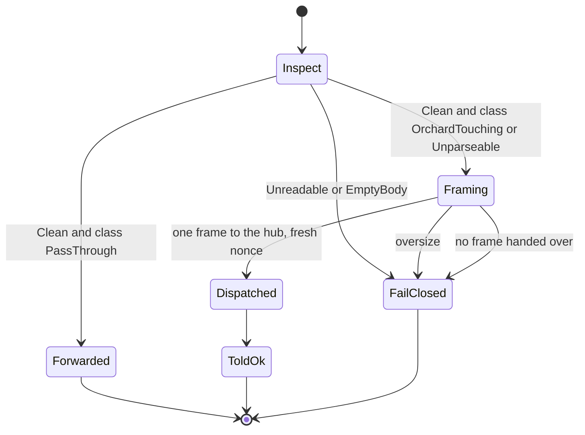
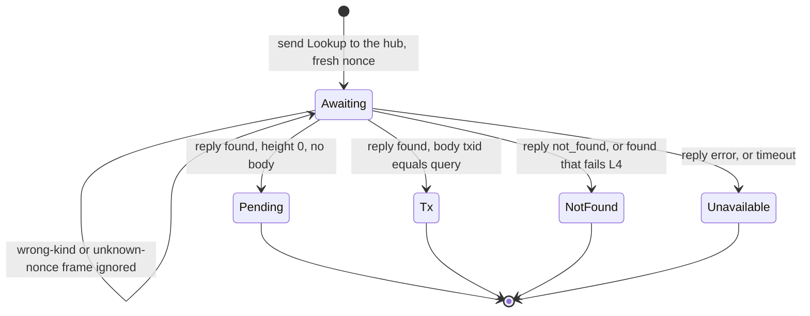
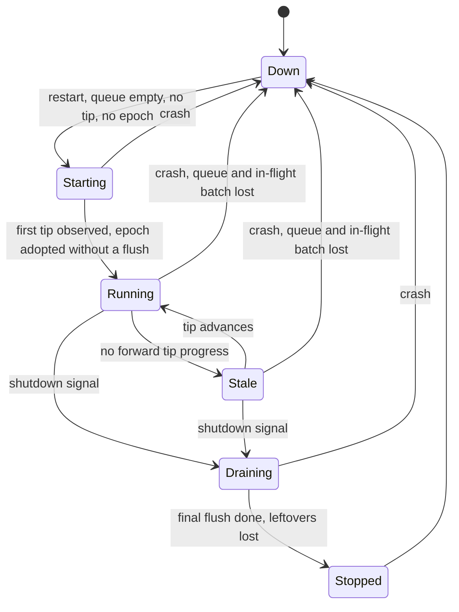
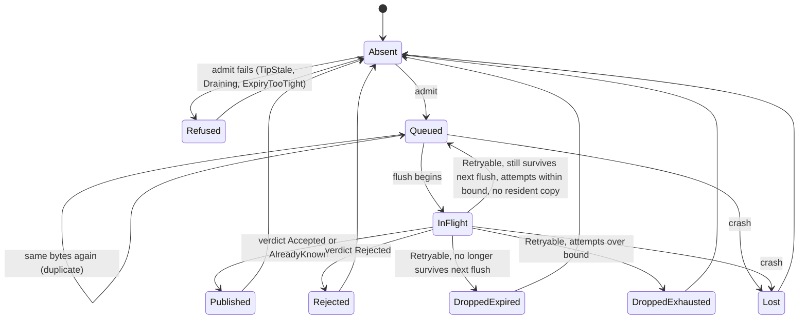

# The zeronym protocol, specified in Quint

A [Quint](https://quint-lang.org) specification of zeronym: the protocol between a wallet, the shim in front of an operator's indexer, the hub that batches diverted transactions, and the chain.

- [System](#system)
- [Assumptions](#assumptions)
- [Threat model](#threat-model)
- [Guarantees](#guarantees)
- [Trust matrix](#trust-matrix)
- [Known gaps](#known-gaps)
- [Out of scope](#out-of-scope)
- [Findings](#findings)
- [How it is checked](#how-it-is-checked)
- [Future work](#future-work)

## System

> Who the actors are, what each one does, and where each lives in the specification.

The architecture diagram and the prose description of the deployment are in [`zeronym/README.md`](../../README.md).

Only the mixnet transport is modelled; the HTTP transport is out of scope (see [Out of scope](#out-of-scope)).

There are two specifications, sharing one hub function:

- **The protocol specification** (`protocol.qnt`): wallet, shim, network, hub, indexer and an outside third party. Its hub is abstract: a queue and the entries out with a flush, with no tip, schedule or phases. It is checked by random simulation and scripted runs.
- **The hub specification** (`hubMachine.qnt`): one hub, the chain, and the two things the hub asks its indexer (the tip, and a verdict on each broadcast). It owns the schedule, expiry, requeue, crash and drain. TLC visits every reachable state of each of its configurations.

Each component is one total function from its state and one input to its next state and one output. An input that is invalid in the current state returns an error output and leaves the state alone. The state machines hold no protocol logic: a step picks an input, calls the function, and puts the output where it goes. `hub.qnt` and `shim.qnt` are the precise statement of what each does.

| Component | Inputs | Outputs | Seam in the implementation |
|---|---|---|---|
| `hub` | `SubmitHInput`, `LookupHInput` (with the indexer's answer), `TipHInput(height)`, `StaleHInput(estimate)`, `FlushDueHInput`, `VerdictHInput`, `FlushDoneHInput`, `DrainHInput`, `CrashHInput`, `RestartHInput` | `AckOutput`, `LookupReplyOutput`, `BroadcastOutput`, `RequeuedOutput`, `NoHubOutput`, `HubErrorOutput` | `Hub::admit`, `Hub::lookup` (`hub/src/server.rs`), `run_listener` (`hub/src/nym.rs`), `TipTracker::observe`, `cadence_height`, `flush` (`hub/src/batcher.rs`), `Queue::requeue`, `Queue::begin_draining` (`hub/src/queue.rs`) |
| `shim` | `SendTxSInput` (with whether the transport took the frame), `GetTxSInput`, `FrameSInput`, `LookupTimeoutSInput` | `ForwardOutput`, `DivertedOutput`, `SendDoneOutput`, `LookupSentOutput`, `LookupDoneOutput`, `NoShimOutput`, `ShimErrorOutput` | `send_transaction`, `divert`, `get_transaction` (`shim/src/intercept.rs`), `NymHandle::submit`, `get_transaction`, `deliver` (`shim/src/nym.rs`) |
| indexer | `BroadcastIInput`, `LookupIInput`, `AdvanceIInput`, `MineIInput` | `VerdictOutput`, `AnswerOutput`, `NoIndexerOutput` | the mock indexer in `hub/tests/common/mod.rs` |

<details>
<summary><b>Shim</b>: routing a send, and one lookup</summary>

Routing one `SendTransaction` (`shim.qnt`):



One `GetTransaction` lookup:



</details>

<details>
<summary><b>Hub</b>: phases, the flush cycle, and one payload's entry</summary>

The hub's phases (`hub.qnt`). `Starting` and `Stale` restate what the tip fields already say (no tip yet; the clock is free-running) and are phases for readability:



The flush cycle:

```mermaid
stateDiagram-v2
    [*] --> Idle
    Idle --> Broadcasting: tip epoch exceeds last flushed epoch, or draining; whole queue moves in flight
    Idle --> Idle: nothing queued, epoch recorded
    Broadcasting --> Broadcasting: indexer returns one entry's verdict
    Broadcasting --> Idle: all verdicts in; requeue retryable entries; record epoch
```



One payload's entry. `Absent --> Queued` is reachable again after `Published`: bytes that were published are admitted again if resubmitted.



</details>

<details>
<summary><b>Indexer, network and third party</b></summary>

- **Chain and indexer** (`indexer.qnt`). A transaction's status only moves forward: absent, in the mempool, mined. The indexer answers lookups and gives a verdict on each broadcast.
- **Network** (`spells/soup.qnt`). A message is added to the soup and never removed. It may be delivered any number of times, in any order, or never.
- **Third party.** A client of the hub's public, unauthenticated address. It may learn a txid out of band, look it up, and resubmit any payload the chain has published.

</details>

### Wire encoding

A hub answers a lookup with one of three wire replies, and the shim turns that into what the wallet sees (`wire.qnt`).

| The hub's situation | Reply on the wire | What the wallet sees |
|---|---|---|
| The transaction is queued here | found, height 0, no body | Pending |
| Its indexer has the transaction | found, with the height and the body | The transaction, if the body's txid is the one asked for; otherwise not found |
| Its indexer says not found | not found | Not found |
| Its indexer cannot be reached | error | Unavailable |
| Its indexer says "found, height 0, no body" (a fault) | found, height 0, no body | Pending |

"Pending" has no reply of its own: it is a found reply with nothing in it. So the first and last rows are the same bytes, and neither the shim nor the wallet can tell "queued at the hub" from "an indexer said found and returned nothing". One misbehaving indexer endpoint is enough to produce the last row (finding 8).

## Assumptions

> What must be true of the world for the claims to apply.

- **Roles.** The shim and the hub both run attested. The shim is modelled as honest in every configuration: it sees every migration in plaintext and controls everything the wallet observes, so no wallet-facing guarantee could survive its compromise. The hub is modelled as honest or Byzantine, not because it is trusted less, but to measure how much each guarantee depends on the hub's enclave. The indexer runs outside any enclave, so a Byzantine indexer is the realistic adversary. One component is Byzantine at a time.
- **Honest and Byzantine.** An honest component takes exactly the transition its function gives. A Byzantine one takes any member of a finite set that contains the honest transition (`byzantineContainsHonestTest`). No message or state field records which it took.
- **Byzantine hub.** It admits or refuses a submission whatever the admission rules say, and may send any reply to a lookup. Its ack is modelled as truthful: a real one could ack anything, but nothing reads an ack. Every other move is the honest one: it cannot evict or withhold a queued entry, flush off schedule, or send a frame nobody asked for.
- **Byzantine indexer.** Any verdict, with the transaction relayed or not. Any lookup answer built from a payload it was offered, one the chain published, or a twin of either. In the hub specification it also reports any tip.
- **Network.** May lose, duplicate, delay and reorder frames. Cannot forge or read them.
- **Third party.** Looks up txids it knows and submits payloads it has learned or the chain has published. It cannot read or forge frames, so it does not know a nonce and cannot answer the shim.
- **Nonces** are unique. A counter stands for an unguessable value.
- **Chain.** No reorg of an included transaction and no mempool eviction. The operator's indexer publishes nothing.
- **Wallets.** A supported ("conforming") wallet sets an expiry at least `MIN_WALLET_EXPIRY` after the height it builds at, and its frame reaches the hub within `DELIVERY_LAG` blocks. A wallet asks only about transactions it has sent.
- **Hub schedule** (hub specification only). How promptly the hub learns the tip depends on the configuration: at every block, up to the reorg allowance behind, or not at all for a while. Fewer blocks arrive while a flush is in flight than the mining margin reserves. The code enforces neither; see [Configurations](#configurations) and findings 1, 2 and 4.
- **Time.** There is no clock. A timeout may happen at any moment; the staleness window is counted in blocks.

Each configuration's assumptions are the guard of its named `init`. A guard that is false leaves no initial state, and the gate fails on that.

## Threat model

> What the specification is afraid of, who could cause it, and whether a property answers it.

The deployment targets the server-side and network-metadata adversaries of Taylor Hornby's [wallet app threat model](https://zcash.readthedocs.io/en/latest/rtd_pages/wallet_threat_model.html); the Security section of [`zeronym/README.md`](../../README.md) says what is and is not protected. This specification covers the part of that which is a property of protocol runs. Which guarantee answers a threat is the "Answers" column under [Guarantees](#guarantees), and which gap records one that is not prevented is the "Threat" column under [Known gaps](#known-gaps).

| # | Threat | Adversary | Status |
|---|---|---|---|
| T1 | The operator sees a migration's contents | Operator behind the shim | Answered |
| T2 | Someone obtains a queued migration's bytes and publishes it early, breaking the batch | Unauthenticated third party; Byzantine hub or indexer | Answered, if the hub and the indexer are honest |
| T3 | The wallet is served a different transaction than the one it asked for | Byzantine hub or indexer | Answered for the txid; not for the bytes or the height |
| T4 | The wallet is told something false about its transaction's status | Byzantine hub or indexer; network reordering | Answered for each answer, if the hub and the indexer are honest; not across answers (T8) |
| T5 | A supported wallet's migration expires while the hub holds it | Chain timing; a flaky tip; Byzantine hub or indexer | Answered in part: under a timely or regressing tip, not under a stale one |
| T6 | The hub silently drops or admits entries outside its rules | Hub implementation error | Answered |
| T7 | The wallet is told "sent" but the hub never admits it | Network; the hub's own refusals | Not prevented |
| T8 | The wallet sees its transaction's status go backwards | Network reordering; resubmission; the flush window | Not prevented |
| T9 | An acknowledged migration is lost to a crash, a failed final flush, or a requeue drop | None needed | Not prevented |
| T10 | A third party who knows a txid learns it is queued | Unauthenticated third party | Accepted |
| T11 | A lying indexer makes the hub flush early, shrinking the batch | Byzantine indexer; one endpoint suffices | Not prevented; recorded |
| T12 | Any admitted transaction, including one from an unsupported wallet, is offered too late | As T5 | Not checked |
| T13 | The hub acknowledges a migration it never queued | Byzantine hub | Not modelled: nothing reads an ack |
| T14 | Linking a wallet to its migration by source IP | Network observer; operator | Not modelled. Claimed protected in `zeronym/README.md` |
| T15 | Linking by submission size and arrival time | Operator | Not modelled. Listed as not protected in `zeronym/README.md` |
| T16 | The operator recovering txid and value through transparent-pool queries | Operator | Not modelled. Listed as not protected in `zeronym/README.md` |
| T17 | Batch-size and timing anonymity; partitioning the anonymity set across hubs | Network observer | Out of scope: timing and anonymity are not trace properties here, and there is one hub |
| T18 | A compromised shim or enclave host | Host; a malicious build | Assumed away. A compromised host is delegated to AWS in `zeronym/README.md`; a malicious shim build is excluded by attestation and is not discussed there |

## Guarantees

> Promises about whole runs of the system: this bad thing never happens.

| Id | Name | What it says | Answers | Checked by |
|---|---|---|---|---|
| G1 | `operatorBlind` | Everything the shim hands the operator is a pass-through transaction | T1 | Simulation |
| G2 | `queuedBytesConfidential` | Everything the third party has learned is on the chain, or was a pass-through transaction given to the operator. Its knowledge is derived from the replies sent to it and the operator's view | T2 | Simulation |
| G3 | `txidAuthenticity` | A transaction served to the wallet has the txid asked for. It need not be the bytes the wallet sent, and its height is whatever the hub said | T3 | Simulation; `servedOnlyOnMatchingTxidTest` exhaustively |
| G4 | `lookupValidityPerHub` | Every lookup answer other than "unavailable" was true at the hub that gave it at some point between request and answer. Not-found during the flush window counts as true, as the implementation intends (`Hub::lookup`, `zeronym/hub/src/server.rs`). It does not say that successive answers agree | T4 | Simulation |
| G6b | `conformingFirstOfferBeforeExpiry` | A supported wallet's transaction is offered with the mining margin to spare, the first time a hub offers it. About the margin left when the flush begins, not about acceptance; nothing about a later offer of a requeued entry | T5 | TLC, exhaustive |
| G6c | `conformingFirstOfferJudgedBeforeExpiry` | End to end: when a node judges the first offer of a supported wallet's transaction, it has not expired. Needs G6b and the flight-time assumption | T5 | TLC, exhaustive |
| G7 | `wellFormedTest` | Structural sanity of the hub: a queued entry is within its attempts and a down hub holds nothing | T6 | Exhaustive test over every reachable hub state |
| A2 | `neverEvictTest` | An entry leaves the hub's queue only into a flush, or because the hub went down or exited after its final flush | T6 | Exhaustive test over every reachable hub state and input |
| A3 | `drainIsFinalTest` | A draining honest hub's queue gains only what a flush hands back | T6 | Exhaustive test over every reachable hub state and input |

A2 and A3 constrain a single hub step, not a state; the rest are state invariants.

Each pure function also has exhaustive tests over small inputs, in `tests/*Test.qnt`.

## Trust matrix

> For each guarantee, whose honesty it depends on.

Single-fault. "holds" is a checked row on the named configuration. "required" is a scripted run in which the component is Byzantine and the guarantee fails; the run asserts the guarantee in the state just before the Byzantine step, so the lie is what breaks it.

| | All honest | Byzantine hub | Byzantine indexer |
|---|---|---|---|
| G1 | holds (`baseline`) | holds (`byzHub`) | holds (`byzIndexer`) |
| G2 | holds (`baseline`) | **required**: `hubServesQueuedBodyTest` | **required**: `indexerServesUnpublishedBodyTest`. One endpoint suffices |
| G3 | holds (`baseline`) | holds (`byzHub`); a twin and a false height are both served | holds (`byzIndexer`) |
| G4 | holds (`baseline`) | **required**: `hubDeniesQueuedTest`, `hubServesFalseHeightTest` | **required**: `indexerForgesPendingTest`. One endpoint suffices |
| G6b | holds (`timely`, `flakyTip`, `flakyTipSlowFlight`) | **required**: `hubAdmitsBeforeFirstTipTest` | **required**: `indexerWithholdsTipFromConformingTest`. Needs every endpoint |
| G6c | holds (`timely`, `flakyTip`) | **required**: `hubAdmitsBeforeFirstTipTest` | **required**: `indexerWithholdsTipFromConformingTest`. Needs every endpoint |
| A3 | holds | **required**: `hubAdmitsWhileDrainingTest` | holds |

- A hub folds several indexer endpoints into one answer: the tip is the maximum, a lookup takes the first "found", a broadcast takes the best verdict. So one misbehaving endpoint can raise the tip, inject a lookup answer or change a verdict, while lowering or freezing the tip takes every endpoint. The model has one abstract indexer and does not enforce that difference; the indexer cells say which each needs.
- There is no shim column: every wallet-facing guarantee assumes an honest, attested shim.
- G3 is the only wallet-facing guarantee that survives a Byzantine hub or indexer, and it authenticates the txid only.
- G1 depends on the shim alone.
- A Byzantine hub breaks G6b by admitting while it has no tip, when an honest hub refuses everything. Admitting past the expiry rule cannot break it, because that rule never refuses a supported wallet's timely transaction (`conformingTimelyPayloadIsAdmissibleTest`).

## Known gaps

> Things you might expect to hold that don't, each with a concrete example run. Every component is honest in all of them.

| Id | Threat | What is lost | Where | Checked by | Scripted run |
|---|---|---|---|---|---|
| K1 | T7 | Told ok does not mean the hub ever admits it: it may refuse the frame, or never receive it | `baseline` | scripted runs | `toldOkThenRefusedTest`, `toldOkAndNeverDeliveredTest` |
| K2 | T8 | `statusNeverRegresses`: what a wallet sees of one transaction never goes backwards | `baseline` | simulation, violated | `repliesReorderedTest`, `walletResendsPublishedTest`, `thirdPartyResubmitsPublishedTest`, `flushWindowTest`, `rejectedAtFlushTest` |
| K3' | T5 | G6b and G6c when the expiry floor leaves no slack for the reorg allowance | `flakyTipNoSlack` | TLC, violated | `conformingMissesMarginWithoutSlackTest` |
| K4 | T5 | G6b and G6c on the shipped relation between the constants, across a tip silence shorter than the staleness window | `staleLag` | TLC, violated | `silenceAcrossBoundaryMissesMarginTest`; contrast `sameSilenceWithSlackKeepsMarginTest` |
| K5 | T9 | `ackedIsHeldOrSettled`: an acknowledged payload is still held by the hub, or is on the chain, or a node judged it | `timely` | TLC, violated three ways | `ackedThenCrashedTest`, `ackedThenLostAtDrainTest`, `requeueDropsAckedAsExpiredTest` |
| K6 | T5 | `conformingEveryOfferBeforeExpiry`: G6b for every offer, not only the first | `staleLag` | TLC, violated | `requeuedPastExpiryTest` |
| K7 | T5 | G6c when a flush may stay in flight for as many blocks as the mining margin | `flakyTipSlowFlight` | TLC, violated; G6b holds there | `slowFlightSpendsTheMarginTest` |
| K8 | T5 | A supported wallet's transaction, acknowledged on time, lost to a crash and resent, is first offered by the restarted hub with less than the mining margin. To the restarted hub the resend is a late first arrival, so G6b and G6c do not cover it | `flakyTip` | scripted run | `crashThenLateDuplicateTest`; control `lateDuplicateWithoutCrashTest` |

K1 is not an invariant because it would be false on the ordinary success path too: the wallet is told ok before the hub has the frame.

Behaviours that are accepted or only recorded:

| Behaviour | Threat | Shown by |
|---|---|---|
| **Accepted disclosure.** A third party that knows a txid learns that it is queued. The hub withholds the bytes, not the fact. The implementation leaves this open deliberately (`Hub::lookup`, `zeronym/hub/src/server.rs`): "the 200-versus-NotFound distinction still discloses that a given txid is queued here. Closing that too means answering NotFound, which costs a wallet the ability to tell "pending" from "never seen"" | T10 | `thirdPartyLearnsItIsQueuedTest`; witness `wQueuedDisclosed` on `baseline` |
| **Twin and false height served.** The wallet can be served a twin of what it sent, and a transaction at a height the hub made up. G3 holds throughout | T3 | `wTwinServed`, `wFalseHeightServed` on `byzHub` |
| **Premature flush.** A Byzantine indexer reports a tip ahead of the chain and the hub flushes before the true boundary. A batching harm, not an expiry one | T11 | `tipAheadOfChainFlushesEarlyTest` |
| **Early flush by the free-running clock.** A stale hub's clock is ahead of the chain and it flushes before the true boundary, with every component honest | T11, with no liar | `freeRunningClockFlushesEarlyTest` |
| **Unparseable and queued.** A payload the hub cannot parse has no txid, so a lookup misses it while it is queued | none | `unparseableIsQueuedAndMissedTest` |

## Out of scope

> What the specification deliberately does not cover, and why.

### One hub

The specification checks one hub; production runs one or more, replicated: every shim sends every submission to every hub, and each hub that receives a migration queues and broadcasts it (`zeronym/shim/src/nym.rs:602-647`). The single hub is a scope choice, not a claim about production.

Not checked as a result: two hubs disagreeing about one transaction; duplicate publication, and a second enclave holding the plaintext, both accepted deliberately in production; told ok after a partial send, and its anonymity cost; a lookup moving to the next address on a timeout (finding 9); that one Byzantine replica is enough to break G2 and G4.

Argued, not checked, on the assumption that hubs share nothing but the chain and the indexer:

- **Compose per hub:** G1, G3, G4 (which is why its name says "per hub"), G6b and G6c, and gap K5.
- **Compose only if every hub is honest:** G2. One Byzantine replica holds the same bytes and can give them away.
- **Do not compose:** K1 and K2 each gain a cause with a second hub.

### Not modelled

| Item | Reason |
|---|---|
| Attestation, PCRs, TLS, STEVE, keymaker quorum | No in-protocol messages exist. Represented by the roles |
| Mixnet internals: SURBs, Sphinx, cover traffic, gateways, throttling; the shim's client rotation; both `nym_driver.rs` | Their protocol-visible effect is loss and delay |
| The hub's lookup concurrency bound, reply deadline and dropped acks | Refinements of "the network lost the message" |
| Wall-clock time | There is no clock: the staleness window is counted in blocks, and a timeout may happen at any moment |
| Multiple indexer endpoints | One abstract indexer stands for all of a hub's endpoints. The trust matrix says, for each Byzantine-indexer cell, whether one lying endpoint suffices |
| Wire codecs, byte layout, malformed frames | Pinned by the Rust tests and golden vectors in both crates. The specification works at the level of what a reply means, and does not bind the codec |
| Reorgs of included transactions, mempool eviction | Assumed away: a transaction's chain status only moves forward |
| Anonymity-set size, shuffle, simultaneity, timing and length side channels | Not properties of a single run |
| The forward-only shim, transparent-pool RPCs, health, address and attestation endpoints, logging | Not part of the divert protocol |
| The HTTP transport, where the shim waits for the hub's verdict before answering the wallet (`HubTransport::Http`, `--hub`) | The production deployment is the mixnet (`HTTP_SUBMIT=0`). So there is no configuration here in which the shim's ok means the hub has the transaction |
| A Byzantine shim | The shim runs attested, sees every migration in plaintext and controls what the wallet observes. Every wallet-facing guarantee assumes it honest |
| What the hub's ack says | Nothing reads an ack: the shim tells the wallet ok without waiting for it. That an accepted ack is only for a queued payload is not a checked property, and a Byzantine hub's ack is modelled as truthful |
| The hub's capacity and size refusals, and denial of service generally | Not claimed properties. The shim's own too-large refusal is modelled |
| A third party submitting payloads of its own making | Possible, since the hub's address is public and unauthenticated. The model's third party submits only what it has learned or the chain has published |
| Wallets whose expiry is below the supported floor | No schedule guarantee is made for them. Admission's own claim that every admitted entry "provably survives" its scheduled flush (`zeronym/hub/src/queue.rs:497-519`) is not checked, and is known not to hold under a tip reported behind the chain |
| More than one Byzantine component at once | The trust matrix is single-fault |
| Liveness: that anything eventually happens, such as a submitted migration being published | The network may lose everything, and nobody waits for an ack |

## Findings

> Where the model disagrees with what the code or its comments assume.

Nothing here has been fixed. "Code read" means the cited lines were read and match the model; nothing was run against the Rust.

| # | Finding | Shown by | Against the Rust |
|---|---|---|---|
| 1 | **A short tip silence costs a supported wallet its mining margin.** The cadence follows the last tip seen, so a silence across a flush boundary delays the flush until the hub goes stale. On the shipped constants the first offer is at `created + 37` against an expiry of `created + 40`: three blocks of margin where four are reserved | K4, `silenceAcrossBoundaryMissesMarginTest`; TLC on `staleLag` | Code read: `batcher.rs:40-71`, `:227-247`. The one-block shortfall reads 15 minutes as exactly 12 blocks |
| 2 | **An early free-running flush spends the next epoch.** A stale hub's clock runs ahead, flushes an empty queue and records that epoch. When the tip returns, admission counts on a flush that has already happened, and the transaction waits a full interval. A wider expiry floor does not fix it | `earlyFlushSpendsTheNextEpochTest`; TLC on `staleLagWithSlack` | Code read: `batcher.rs:316-326`. The comment there calls a clock that runs ahead "the safe direction" |
| 3 | **The reorg slack holds by coincidence of constants.** The expiry floor minus the three-term budget is 10 blocks, exactly the reorg allowance, and startup validation checks only the three-term sum. Without the slack a supported wallet's transaction misses its margin | K3', `conformingMissesMarginWithoutSlackTest`; TLC on `flakyTipNoSlack` | Code read: `batcher.rs:40-59`, `:101-113` |
| 4 | **Nothing bounds a flush's flight in blocks.** The budget leaves exactly the mining margin at the offer, so blocks that arrive while the batch is in flight come out of it | K7, `slowFlightSpendsTheMarginTest`; TLC on `flakyTipSlowFlight` | Code read: `chain.rs` bounds each call (`RPC_TIMEOUT`), not the batch |
| 5 | **An acknowledged payload can be lost three ways with every component honest:** a crash; a draining hub's final flush that finds the indexer unreachable; a requeue that gives the entry up as expired after two unjudged flushes | K5 and its three runs; TLC on `timely` | Code read: the queue is in memory only (`queue.rs:226-243`, `batcher.rs:337-347`) |
| 6 | **A crash plus a late duplicate is offered past the margin.** A restarted hub adopts the current epoch without flushing; told a tip one block back, it admits the resend counting on a flush that will not happen | K8, `crashThenLateDuplicateTest` | Code read: `batcher.rs:177-186`, `:316-327`; `queue.rs:294`, `:507-519` |
| 7 | **An entry with an expiry can be dropped as exhausted.** On a hub that sees no tip, each requeue judges the entry against the same stale tip, so the expiry rule never gives it up and the attempt bound does | `expiringEntryDroppedAsExhaustedTest` | Code read, and it contradicts a comment: `queue.rs:197` says "Only reachable for a payload with no expiry". The shipped bound is 8 requeues |
| 8 | **One indexer endpoint can make a wallet see "pending" for a transaction nobody holds.** "Found, height 0, no body" from an indexer is byte-identical to the hub's own queue-hit reply, and the hub forwards it unchanged | `sentinelCollisionTest`, `indexerForgesPendingTest` | Code read: `server.rs:445-451`, `chain.rs:284-290`, `:305-319` |
| 9 | **Lookups choose a hub by apparent liveness.** A lookup starts at a rotating cursor and moves to the next address only on a timeout, the pattern the submit path forbids. Whoever can make one hub time out decides which hub answers | Not modelled: needs more than one hub | Code read: `shim/src/nym.rs:746-797`, against the rule at `:630-633`. Unexamined; not claimed as a bug |

On finding 2, the model lets the free-running clock be at most one flush interval ahead, so it can spend one epoch. `cadence_height` has no such cap. Reading that code, a clock further ahead would skip more than one boundary; the model does not exhibit that.

## How it is checked

> How much to trust a green row, and how to produce one.

```sh
sh zeronym/spec/quint/check.sh
```

"Holds" means one of three things, and the "Checked by" column says which:

- **TLC, exhaustive.** The hub specification. TLC visits every reachable state of the named configuration. The configurations are small (two or three payloads, a schedule scaled down from the shipped one, heights up to 12), so this is exhaustive for those parameters and not beyond them.
- **Exhaustive test.** `quint test` over a small finite universe: every input of a function, or every reachable hub state.
- **Simulation.** The protocol specification. `quint run`: at most 40 or 80 steps per trace, 2000 random traces, one seed. Not a proof and not exhaustive to any depth; a property that holds is one no sampled trace violated.

`quint verify` has not been run on any part of this. TLC is run through `tlc.sh`, because the compiled specification is larger than the Apalache server accepts.

| Tier | What | Expectation |
|---|---|---|
| 1 | `quint typecheck` on every file | ok |
| 2 | `quint test` on every test file | all pass, and each file reports at least the count `check.sh` gives it |
| 3 | `quint run`, invariants | "holds" rows hold; K2 is violated |
| 3b | `quint run`, witnesses | every listed state is reached at least once; no invariant is violated on the way |
| 4 | `tlc.sh`, one row per invariant and configuration | "holds" rows hold over every reachable state; "violated" rows are violated by a counterexample no longer than the recorded one |

Quint 0.33.0 is pinned (`npx --yes @informalsystems/quint@0.33.0` by default; set `QUINT=quint` to use an installed one). Tier 4 needs Java and Apalache 0.62.1, whose jar carries TLC; without either the tier fails, it never skips. `CHECK_TIERS=simulation` runs tiers 1 to 3b and `CHECK_TIERS=tlc` tiers 1 and 4; CI runs them as two jobs. All four tiers take about six minutes on a 16-core machine. It has not been timed on a CI runner.

### Configurations

A configuration is a value held in the state and selected by a named init.

Protocol specification (at most 3 sends and 3 lookups by the wallet, 3 requests by the third party):

| Configuration | Hub | Indexer |
|---|---|---|
| `baseline` | honest | honest |
| `byzHub` | **Byzantine** | honest |
| `byzIndexer` | honest | **Byzantine** |

Hub specification. The schedule flushes every 3 blocks with a mining margin of 2, a delivery lag of 1, a reorg allowance of 1, a staleness window of 3 and an expiry floor of 7. It is the shipped schedule scaled down (interval 20, margin 4, lag 6, reorg allowance 10, staleness window 12 blocks, expiry floor 40), keeping the relations between the constants that the findings turn on.

| Configuration | Differs from `timely` by | For |
|---|---|---|
| `timely` | | G6b, G6c, K5 |
| `flakyTip` | the tip may be reported up to the reorg allowance behind | G6b, G6c under regression; K8 |
| `flakyTipNoSlack` | and the expiry floor is 6, leaving no reorg slack | K3' |
| `flakyTipSlowFlight` | and a flush may be in flight for 2 blocks | K7 |
| `staleLag` | the hub may hear no tip, and goes stale | K4, K6 |
| `staleLagWithSlack` | and the expiry floor is 8, enough to cover the silence | finding 2 |
| `byzHub`, `byzIndexer` | one Byzantine component, and a tight-expiry payload | the trust matrix |
| `unknownUpgrade` | an unparseable payload; scripted runs only | the attempt bound |

In every configuration a due flush begins before the next block, and at most one block arrives while a flush is in flight (two in `flakyTipSlowFlight`). Under `staleLag` a hub is stale once it has heard no tip for the staleness window; its free-running clock is then assumed never behind the chain and at most one flush interval ahead of it. The implementation relies on "never behind" and does not enforce it (`zeronym/hub/src/batcher.rs:64-67`).

<details>
<summary>What TLC visits</summary>

With 8 workers, on the machine this was written on:

| Configuration | Invariant | Verdict |
|---|---|---|
| `timely` | G6b and G6c | holds, 20 030 states, depth 40 |
| `timely` | K6's predicate | holds, 20 030 states, depth 40 |
| `flakyTip` | G6b and G6c | holds, 113 496 states, depth 38 |
| `flakyTipSlowFlight` | G6b | holds, 156 352 states, depth 39 |
| `flakyTipNoSlack` | G6b (K3') | violated, 12 states |
| `flakyTipSlowFlight` | G6c (K7) | violated, 14 states |
| `staleLag` | G6b; G6c; K6 | violated, 13; 14; 13 states |
| `staleLagWithSlack` | G6b; G6c (finding 2) | violated, 19; 20 states |
| `timely` | K5 | violated: 5 states; 8 without a crash; 12 without a shutdown either |
| `byzHub` | G6b; G6c | violated, 12; 13 states |
| `byzIndexer` | G6b; G6c | violated, 16; 17 states |

TLC runs with deadlock checking off, so a machine whose steps had died would hold everything. The gate therefore also requires one reachable state per family of steps, and the antecedents of G6b and G6c, each as a violated `not(..)` row.

</details>

### The abstraction lemma

The protocol specification's hub is the abstract one in `abstractHub.qnt`. `hubTest` checks, over every reachable state of the real hub function and every input, that each real step is a step of the abstract hub (`abstractionTest`, `byzantineAbstractionTest`), and that each abstract move has a real step behind it (`realisesTest`). So an invariant that holds over the abstract hub, and reads only queue membership and wire replies, holds over the real one: that covers G2, G3 and G4. It does not transfer reachability: the abstract hub answers where the real one is down or stale, so a violation shown over it is a state of the abstract hub. The reachable set is computed at a smaller schedule than the hub specification's and carried over by argument.

### Layout

Only `protocol.qnt` and `hubMachine.qnt` declare variables, and no module declares a constant. Every other module is pure.

| File | Owns |
|---|---|
| `spells/basicSpells.qnt`, `spells/soup.qnt` | `Option` and set and map helpers; the message soup |
| `types.qnt` | The vocabulary: payloads, verdicts, refusals, roles, observations |
| `wire.qnt` | The four frames; `render`, `meaning`, `interpretReply` |
| `indexer.qnt` | The chain and indexer as a relation, honest and Byzantine |
| `hub.qnt` | `hub(state, input)`: admission, the tip rule, the flush cycle, requeue; the Byzantine relation |
| `shim.qnt` | `shim(state, input)`: routing and reply correlation |
| `hubMachine.qnt` | The hub specification: one hub, the chain, its configurations and invariants |
| `abstractHub.qnt` | The hub as the protocol sees it |
| `protocol.qnt` | The protocol specification: state, steps, guarantees, gaps, witnesses, configurations |
| `tests/wireTest.qnt`, `indexerTest.qnt`, `shimTest.qnt`, `hubTest.qnt` | The functional properties; in `hubTest.qnt` also G7, A2, A3 and the abstraction lemma |
| `tests/hubScenariosTest.qnt` | Scripted runs of the hub specification: one per gap and per trust-matrix cell |
| `tests/scenariosTest.qnt`, `tests/trustTest.qnt` | Scripted runs of the protocol specification: gaps and witnesses; trust-matrix cells |
| `check.sh`, `tlc.sh` | The gate; one TLC check of one invariant on one configuration |

## Future work

> What would make these results bind the code.

1. **Failing Rust tests for the findings.** Each finding above is shown on the model and matched to the code by reading. Turning each into a failing test needs changes to the code so that an end-to-end run can be driven deterministically: a controllable tip, a controllable indexer, and a hub that can be crashed and restarted in a test.
2. **Model-based testing with `quint-connect`.** Depends on 1, and needs driver code in Rust. The specification is shaped for it: every branch of a step is a named action with its choices as named picks; each step gives one input to one component function and applies one output; and those functions map onto the seams in the table under [System](#system).
3. **`quint verify` with Apalache for a subset of the claims.** The compiled specification is too large for the Apalache server today. A subset small enough to pass would give bounded symbolic checking of the protocol guarantees, which are simulated only.
